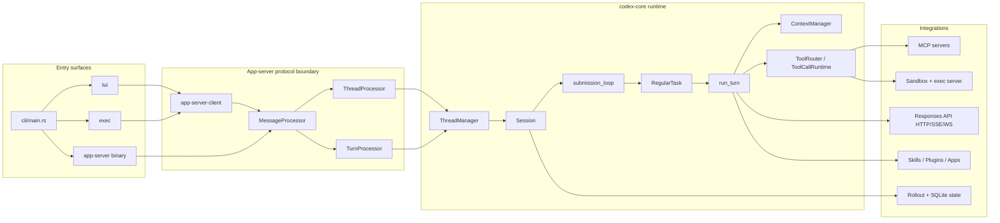
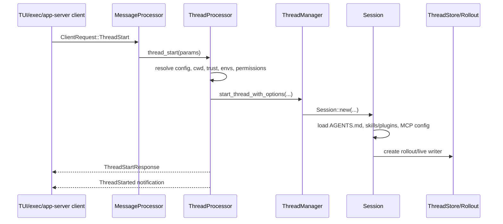
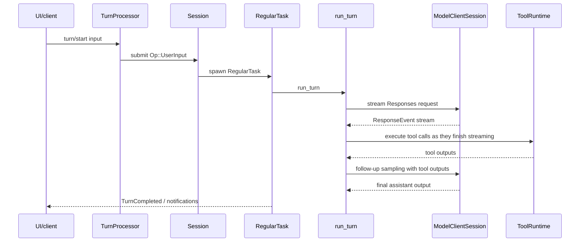

# Architecture

生成日期：2026-06-18  
范围：`/Users/xiaodong/Desktop/learn/codex`

## Summary

Codex 的核心架构是“多入口 + app-server 协议边界 + core agent runtime + integrations”。入口层不直接实现 agent loop，而是把不同 UI/CLI 形态统一成 thread/turn 请求；`codex-core` 负责上下文、模型采样、工具调用、sandbox、持久化和事件流。

## High-Level Diagram

## Main Runtime Objects

- Thread：用户可恢复、可 fork、可归档的一条会话线。app-server API 的 `ThreadStartParams` 在 `codex-rs/app-server-protocol/src/protocol/v2/thread.rs:52`。
- Session：一个 thread 在 core 内的运行态。`Session` 字段在 `codex-rs/core/src/session/session.rs:23`，`SessionConfiguration` 在 `codex-rs/core/src/session/session.rs:49`。
- Turn：一次用户输入到模型完成的循环。`TurnStartParams` 在 `codex-rs/app-server-protocol/src/protocol/v2/turn.rs:67`，core 的 `run_turn` 在 `codex-rs/core/src/session/turn.rs:126`。
- Op：客户端提交给 core 的操作，如用户输入、审批、打断、设置更新。`submission_loop` 在 `codex-rs/core/src/session/handlers.rs:700` 分发。
- ResponseItem：模型上下文、模型输出、工具调用和工具输出的统一历史单元。
- Tool：模型可见 spec + runtime executor。`ToolRouter` 在 `codex-rs/core/src/tools/router.rs:35`，registry dispatch 在 `codex-rs/core/src/tools/registry.rs:403`。
- Rollout：JSONL 会话记录。`RolloutRecorder` 在 `codex-rs/rollout/src/recorder.rs:66`。

## Thread Start Flow

Key code:

- app-server request dispatch：`codex-rs/app-server/src/message_processor.rs:1075`。
- thread processor start task：`codex-rs/app-server/src/request_processors/thread_processor.rs:1015`。
- core thread start：`codex-rs/core/src/thread_manager.rs:582`。
- session init：`codex-rs/core/src/session/session.rs:470`。
- project instructions load：`codex-rs/core/src/session/session.rs:824`。

## Turn Flow

Key code:

- app-server turn processor：`codex-rs/app-server/src/request_processors/turn_processor.rs:381`。
- `Op::UserInput` handling：`codex-rs/core/src/session/handlers.rs:183`。
- task lifecycle：`codex-rs/core/src/tasks/mod.rs:319`。
- regular task loop：`codex-rs/core/src/tasks/regular.rs:36`。
- model/tool loop：`codex-rs/core/src/session/turn.rs:207`。
- stream event tool dispatch：`codex-rs/core/src/stream_events_utils.rs:404`。

## Model Context Architecture

Context is layered, bounded, and incrementally updated:

- Initial context is built in `codex-rs/core/src/session/mod.rs:2861`.
- Model-visible contextual user fragments live under `codex-rs/core/src/context/` and implement `ContextualUserFragment`.
- Settings/environment/personality/model updates are diffed in `codex-rs/core/src/context_manager/updates.rs:214`.
- History is stored by `ContextManager` in `codex-rs/core/src/context_manager/history.rs:32`.

This solves three problems:

- the model sees enough local state to act;
- long-running threads avoid rebuilding everything on every turn;
- prompt-cache misses are reduced by separating stable context from per-turn deltas.

## Tool Architecture

Tool execution has a planning layer and a runtime layer:

- `build_tool_specs_and_registry` in `codex-rs/core/src/tools/spec_plan.rs:167` decides what tools are model-visible.
- `ToolRouter` in `codex-rs/core/src/tools/router.rs:112` converts model output into executable `ToolCall`.
- `ToolCallRuntime` in `codex-rs/core/src/tools/parallel.rs:62` handles parallel/nonparallel scheduling.
- `CoreToolRegistry` dispatches through hooks, permissions, telemetry, and terminal outcomes in `codex-rs/core/src/tools/registry.rs:403`.
- Concrete handlers include shell, apply_patch, MCP, web/search, image, browser/plugin-suggest, etc.

## Integration Boundaries

- Responses API boundary：`codex-rs/core/src/client.rs:782` builds request; `codex-rs/core/src/client.rs:1610` picks WebSocket or HTTP streaming.
- MCP boundary：`codex-rs/codex-mcp/src/connection_manager.rs:106` owns MCP clients; `list_all_tools` is at `codex-rs/codex-mcp/src/connection_manager.rs:446`。
- Sandbox boundary：`codex-rs/core/src/sandboxing/mod.rs:42` defines `ExecRequest`; `codex-rs/core/src/exec.rs:331` builds sandboxed exec requests。
- Persistence boundary：`codex-rs/rollout/src/recorder.rs:790` records canonical items; `codex-rs/thread-store/src/local/live_writer.rs:77` appends and flushes.

## Architectural Intent Vs Reality

- Intent：`codex-core` should be business logic, with reusable logic migrated into smaller crates. Reality：`codex-core` remains the largest and most central crate; new runtime behavior still tends to touch it.
- Intent：app-server v2 is the active external API boundary. Reality：CLI/TUI/exec still carry important product behavior outside protocol types, especially bootstrap and UI state.
- Intent：context should be incremental and bounded. Reality：`session/mod.rs` still contains a very large initial-context builder and comments/TODOs indicate not every model-visible fragment has perfect diff coverage.

