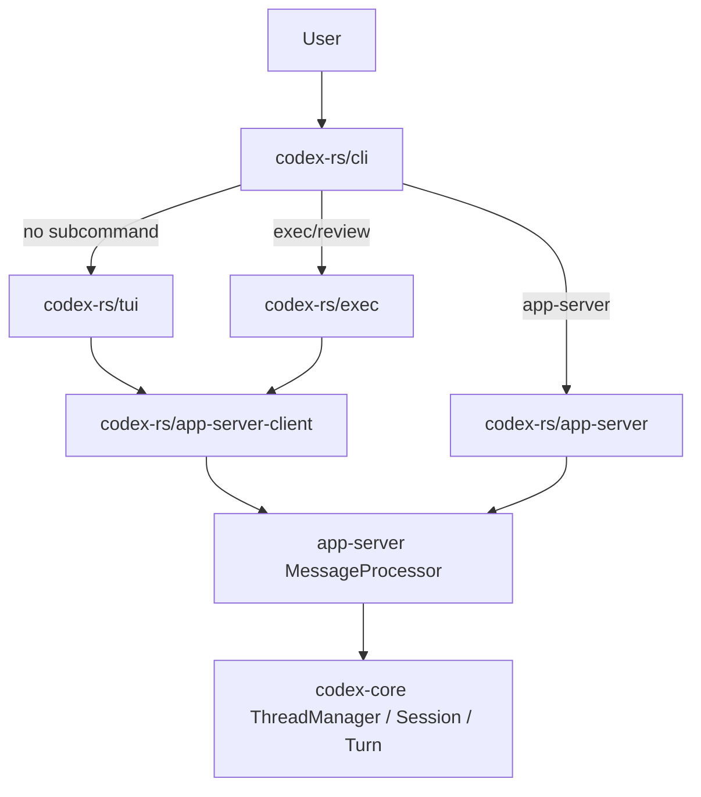

# Structure

生成日期：2026-06-18  
范围：`/Users/xiaodong/Desktop/learn/codex`

## Summary

仓库可以分为四层：外层分发/文档，Rust workspace，插件/技能与本地维护脚本，学习/分析文档。真正的 agent 主路径在 `codex-rs/`，其中入口层把请求转为 app-server 协议，app-server 再调用 `codex-core` 的 thread/session/turn 运行时。

## Top-Level Directories

- `codex-rs/`：Rust 主 workspace。所有核心 agent 功能都在这里。
- `docs/`：本次新增 `docs/codebase/`，用于代码库知识索引；不要与官方产品文档混淆。
- `learn/`：本地学习材料和源码解析文档。本次主文档写入此目录。
- `.agents/skills/`：本地技能说明，本次使用 `acquire-codebase-knowledge` 与 `architecture-blueprint-generator`。
- `codex-rs/vendor/`：第三方 vendored 代码，如 bubblewrap 测试子项目。
- `.github/`：CI/workflow、issue/PR 配置。
- `.devcontainer/`：开发容器配置；扫描脚本未识别到它，这是扫描器能力边界。

## Rust Workspace: Major Areas

- `codex-rs/cli`：用户命令入口。`codex-rs/cli/src/main.rs:123` 定义 subcommand，`codex-rs/cli/src/main.rs:963` 进入 `cli_main`。
- `codex-rs/tui`：交互式终端 UI。`codex-rs/tui/src/lib.rs:844` 负责把 CLI 参数、配置、云配置和 app-server client 串起来。
- `codex-rs/exec`：非交互/headless 执行入口。`codex-rs/exec/src/lib.rs:238` 解析命令并启动 in-process app-server client。
- `codex-rs/app-server`：面向 UI/IDE/远程客户端的协议服务器。`codex-rs/app-server/src/message_processor.rs:185` 聚合各类 request processor。
- `codex-rs/app-server-client`：TUI/exec 使用的 in-process app-server facade。`codex-rs/app-server-client/src/lib.rs:320` 定义启动参数。
- `codex-rs/app-server-protocol`：v2 RPC 与通知类型。`codex-rs/app-server-protocol/src/protocol/common.rs:209` 生成 `ClientRequest`。
- `codex-rs/core`：agent runtime。包含 thread manager、session、turn loop、context、tool runtime、sandbox coordination。
- `codex-rs/protocol`：core 与客户端共享的内部事件和操作类型。
- `codex-rs/codex-api`：OpenAI Responses API HTTP/SSE/WebSocket client 模型。
- `codex-rs/codex-mcp`：MCP server 生命周期、工具/资源/模板聚合与调用。
- `codex-rs/tools`：工具 spec、runtime trait、loadable/dynamic/hosted tool 模型。
- `codex-rs/core-skills`：skill discovery、metadata rendering、SKILL.md 注入。
- `codex-rs/core-plugins`、`codex-rs/plugin`：插件 manifest、加载、禁用、推荐、hook/MCP/app/skill 根目录。
- `codex-rs/rollout`、`codex-rs/state`、`codex-rs/thread-store`：会话持久化、SQLite metadata、JSONL rollout。
- `codex-rs/sandboxing`、`codex-rs/linux-sandbox`、`codex-rs/windows-sandbox`、`codex-rs/exec-server`：跨平台执行和 sandbox。

## Entry Paths

## Core Runtime Structure

- `core/src/thread_manager.rs`：创建、恢复、fork thread；持有 auth、model、environment、skills、plugins、MCP、thread store 等共享服务。
- `core/src/session/mod.rs`：spawn session、记录初始历史、构造初始上下文、接收 `Op`。
- `core/src/session/session.rs`：`Session` 与 `SessionConfiguration` 的状态实体。
- `core/src/session/handlers.rs`：`submission_loop`，把 `Op::UserInput` 等转为 task。
- `core/src/tasks/regular.rs`：普通用户 turn 的 task loop。
- `core/src/session/turn.rs`：核心模型采样与工具调用循环。
- `core/src/tools/`：tool router、registry、parallel runtime、具体 shell/apply_patch/MCP handler。
- `core/src/context/` 与 `core/src/context_manager/`：模型上下文片段与增量更新。

## Test Structure

- `codex-rs/core/tests/suite/mod.rs:1` 聚合 core 集成测试，覆盖 agent execution、tools、skills、MCP、resume、prompt caching 等。
- `codex-rs/app-server/tests/suite/mod.rs:1` 与 `codex-rs/app-server/tests/suite/v2/mod.rs:1` 聚合 app-server v2 RPC 集成测试。
- `codex-rs/tui/src/**` 中大量 `insta::assert_snapshot!` 覆盖终端渲染。
- `codex-rs/core/tests/common/responses.rs:38` 定义 `ResponseMock`，用于捕获模型请求。
- `codex-rs/core/tests/common/test_codex.rs:1` 提供 `test_codex`、本地/远程环境、mock server 等集成测试支撑。

## Generated And Schema Areas

- `codex-rs/core/config.schema.json`：由 `just write-config-schema` 更新。
- `codex-rs/app-server-protocol/schema/`：由 `just write-app-server-schema` 更新。
- `codex-rs/app-server-protocol/tests/schema_fixtures.rs:11` 确认 schema fixtures 与生成结果一致。

## Local Analysis Artifacts

- `docs/codebase/.codebase-scan.txt`：本次技能扫描脚本输出。
- `docs/codebase/*.md`：本次新增七份代码库知识卡片。
- `learn/codex-implementation-source-analysis.md`：本次新增源码解析长文。
- `learn/codex-source-structure.md`：已有源码结构学习文档，本次未覆盖。

