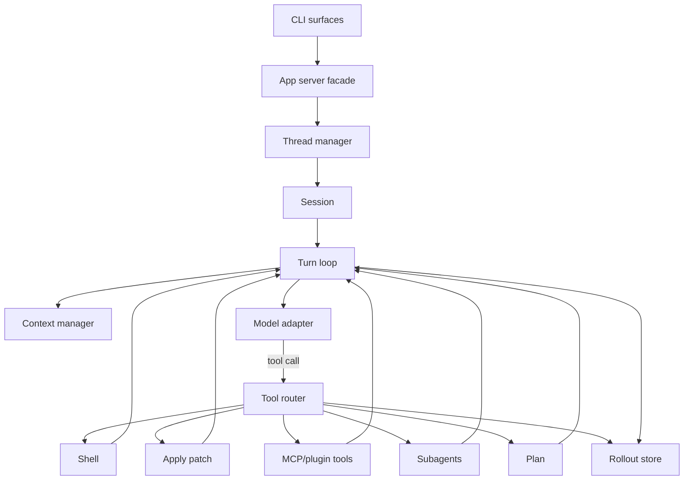

# Codex From Scratch

这个目录是一套“从零实现一个教学版 Codex”的分章节教程。它参考当前仓库源码、`docs/codebase/` 结构化分析文档，以及 `learn/codex-implementation-source-analysis.md`、`learn/codex-source-structure.md`，把 Codex CLI 的实现拆成一条可运行、可理解、可逐步扩展的路径。

教学版代码使用 Python 标准库实现，并且每一步都接入 OpenAI 兼容的真实聊天模型。第一步先跑通“输入、历史、模型、输出”的最小链路，后续步骤都在上一步代码基础上增加或修改 runtime 能力：流式事件、工具调用、补丁、审批、持久化、app-server、MCP/skills/plugins、多 agent 等。

## 学习路径

| 步骤 | 目录 | 主题 | 你会得到什么 |
| --- | --- | --- | --- |
| 1 | `step1-basic-loop` | 最小 agent loop | 一个带历史的 REPL，理解 turn/history/final answer |
| 2 | `step2-streaming-events` | 流式事件 | 把内部状态变成 UI 可消费的事件流 |
| 3 | `step3-shell-tools` | shell 工具 | 模型请求工具、runtime 执行、工具输出回灌 |
| 4 | `step4-file-editing` | apply_patch | 用结构化 patch 修改文件并继续 agent loop |
| 5 | `step5-approvals-sandbox` | 审批与沙箱 | 命令/文件改动进入权限策略与工作区约束 |
| 6 | `step6-context-instructions` | 上下文与 AGENTS.md | 加载项目指令、环境摘要、bounded context |
| 7 | `step7-persistence-resume` | rollout 与 resume | JSONL 会话持久化、列出和恢复 thread |
| 8 | `step8-app-server-protocol` | app-server 协议 | 用 JSON-RPC 风格的 thread/start、turn/start 统一入口 |
| 9 | `step9-exec-tui-frontends` | exec 与 TUI-lite | 同一 runtime 支持非交互执行和交互前端 |
| 10 | `step10-mcp-skills-plugins` | MCP、skills、plugins | 外部工具和指令包进入同一 tool/context 管线 |
| 11 | `step11-multi-agent-planning` | 计划、多 agent、动态工具 | plan 工具、子 agent、tool search 的简化实现 |
| 12 | `step12-complete-mini-codex` | 完整教学版 Codex | 汇总 CLI、本地服务、工具、上下文、持久化、扩展和 review |

## 总体架构



真实 Codex 的对应主线是：

- 入口：`codex-rs/cli`、`codex-rs/tui`、`codex-rs/exec`。
- app-server 协议边界：`codex-rs/app-server`、`codex-rs/app-server-protocol`、`codex-rs/app-server-client`。
- agent runtime：`codex-rs/core/src/thread_manager.rs`、`codex-rs/core/src/session/*`、`codex-rs/core/src/tasks/*`。
- 模型和工具循环：`codex-rs/core/src/session/turn.rs`、`codex-rs/core/src/client.rs`、`codex-rs/core/src/tools/*`。
- 扩展和集成：`codex-rs/codex-mcp`、`codex-rs/core-skills`、`codex-rs/core-plugins`、`codex-rs/rollout`、`codex-rs/thread-store`。

## 如何运行

每个步骤目录都有一个 `mini_codex.py`，可以直接运行。所有步骤都需要先设置 OpenAI 兼容模型的环境变量：

```bash
cd learn/codex-from-scratch/step1-basic-loop
export OPENAI_API_KEY="你的 API key"
export OPENAI_MODEL="你的模型名"
export OPENAI_BASE_URL="https://api.openai.com/v1"
python3 mini_codex.py --once "hello codex"
```

后续步骤沿用同一组环境变量。例如：

```bash
cd learn/codex-from-scratch/step3-shell-tools
python3 mini_codex.py --once "run echo hello"
```

最后一步提供多个入口：

```bash
cd learn/codex-from-scratch/step12-complete-mini-codex
python3 mini_codex.py exec "plan build a demo"
python3 mini_codex.py chat
printf '{"id":1,"method":"thread/start","params":{"cwd":"."}}\n' | python3 mini_codex.py server
```

## 教学版与真实 Codex 的关系

这套教程刻意保留“架构形状”，省略生产级复杂度。真实 Codex 需要处理跨平台 sandbox、复杂审批、模型流重试、SSE/WS、权限继承、TUI 快照、插件安装、远程环境、认证、telemetry、app-server schema、MCP 生命周期等大量边界条件。教学版会在每章指出对应源码位置，并用最小代码演示同一个概念。

最后一步的“完整”指覆盖 Codex CLI 的主要功能类别和运行链路，而不是复制所有生产实现细节。
