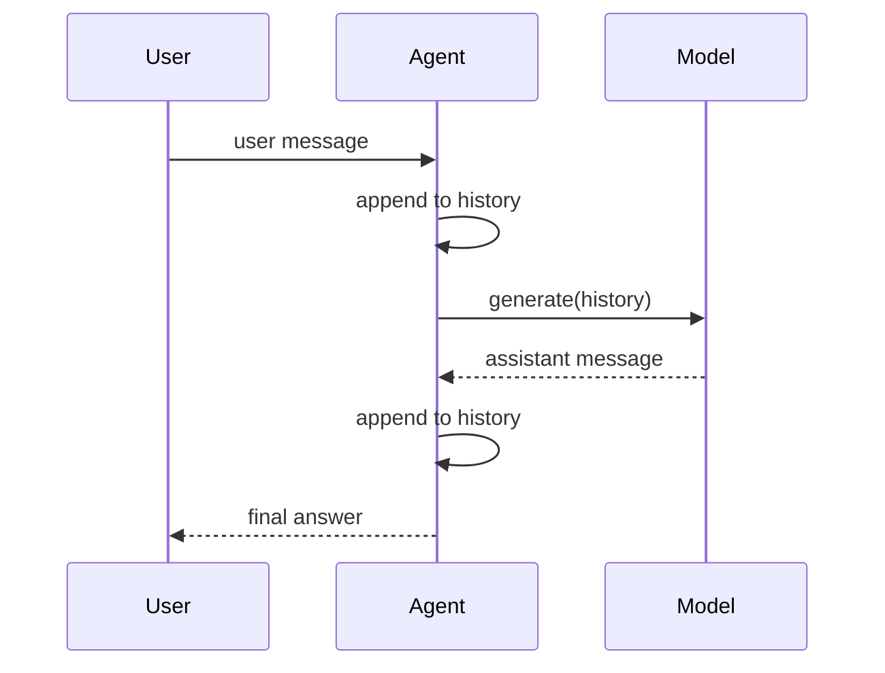

# Step 1: Basic Agent Loop

本章从最小的 agent loop 开始：用户输入一条消息，agent 把它加入历史，模型根据历史生成回答，然后进入下一轮。

## 本步目标

- 实现一个可以运行的 REPL。
- 引入 `Message`、`History`、`Agent`、`Model` 四个概念。
- 理解 Codex 里的 `turn`：一次用户输入到一次最终回答。



## 相对真实 Codex 的位置

真实 Codex 不会把所有逻辑写在一个 REPL 里，但核心概念相同：

- `TurnStartParams`：`codex-rs/app-server-protocol/src/protocol/v2/turn.rs`
- `Op::UserInput`：`codex-rs/protocol/src/protocol.rs`
- `submission_loop`：`codex-rs/core/src/session/handlers.rs`
- `run_turn`：`codex-rs/core/src/session/turn.rs`

真实路径是 UI/app-server 提交 turn，core session 创建 task，再进入 `run_turn`。本章先把这些压缩成一个函数，方便看到“输入、历史、输出”的骨架。

## 运行

```bash
python3 mini_codex.py --once "hello codex"
python3 mini_codex.py
```

REPL 中输入 `/history` 可以查看历史，输入 `/quit` 退出。

## 实现逻辑

`RuleBasedModel` 是一个本地规则模型。它不调用网络，只根据最后一条用户消息生成回答。这样第一步可以专注 runtime 结构，而不是 API 细节。

`Agent.turn()` 是本章最重要的函数：

1. 记录用户消息。
2. 调用模型。
3. 记录 assistant 消息。
4. 返回最终文本。

## 下一步

真实 Codex 会把模型输出、工具状态、错误和完成状态都转成事件流，让 TUI/exec/app-server 可以实时渲染。下一章会加入流式事件。
