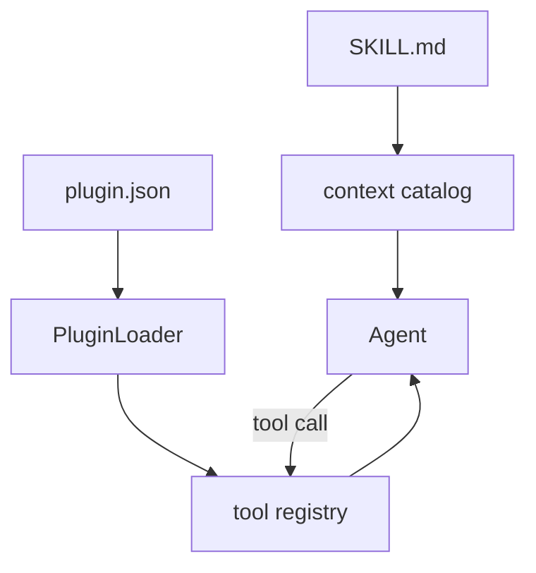

# Step 10: MCP, Skills, And Plugins

本章加入扩展系统。真实 Codex 通过 skills 注入指令，通过 plugins 提供 skill roots、MCP servers、apps 和 hooks，通过 MCP 把外部工具接入同一条工具管线。

## 本步目标

- 扫描 `.mini-codex/skills/*/SKILL.md`。
- 扫描 `.mini-codex/plugins/*/plugin.json`。
- 把插件声明的工具注册到 tool registry。
- 支持 `skills/list`、`plugins/list`、`mcp/list-tools`。



## 解决的问题

把所有能力写进 core 会让 `codex-core` 变得越来越大。扩展系统允许：

- 用 skills 追加可按需注入的长指令。
- 用 plugins 打包工具、skills、MCP 配置。
- 用 MCP 连接外部服务和本地工具。

## 源码映射

- skills service：`codex-rs/core-skills/src/service.rs`
- skill 渲染：`codex-rs/core-skills/src/render.rs`
- plugin manifest：`codex-rs/plugin/src/manifest.rs`
- plugin manager：`codex-rs/core-plugins/src/manager.rs`
- MCP connection manager：`codex-rs/codex-mcp/src/connection_manager.rs`
- MCP tool handler：`codex-rs/core/src/tools/handlers/mcp.rs`

## 运行

```bash
python3 mini_codex.py init-sample-extension --codex-home /tmp/mini-codex-ext
python3 mini_codex.py skills/list --codex-home /tmp/mini-codex-ext
python3 mini_codex.py plugins/list --codex-home /tmp/mini-codex-ext
python3 mini_codex.py exec --codex-home /tmp/mini-codex-ext "reverse hello"
```

## 实现逻辑

教学版插件 manifest 很小：

```json
{
  "name": "demo-tools",
  "tools": [{"name": "reverse", "description": "Reverse text"}]
}
```

runtime 会把它变成一个 `PluginTool`。模型请求 `reverse` 时，工具执行并把结果回灌。

## 下一步

扩展系统打开了工具边界。下一章会加入计划、动态工具搜索和子 agent。
