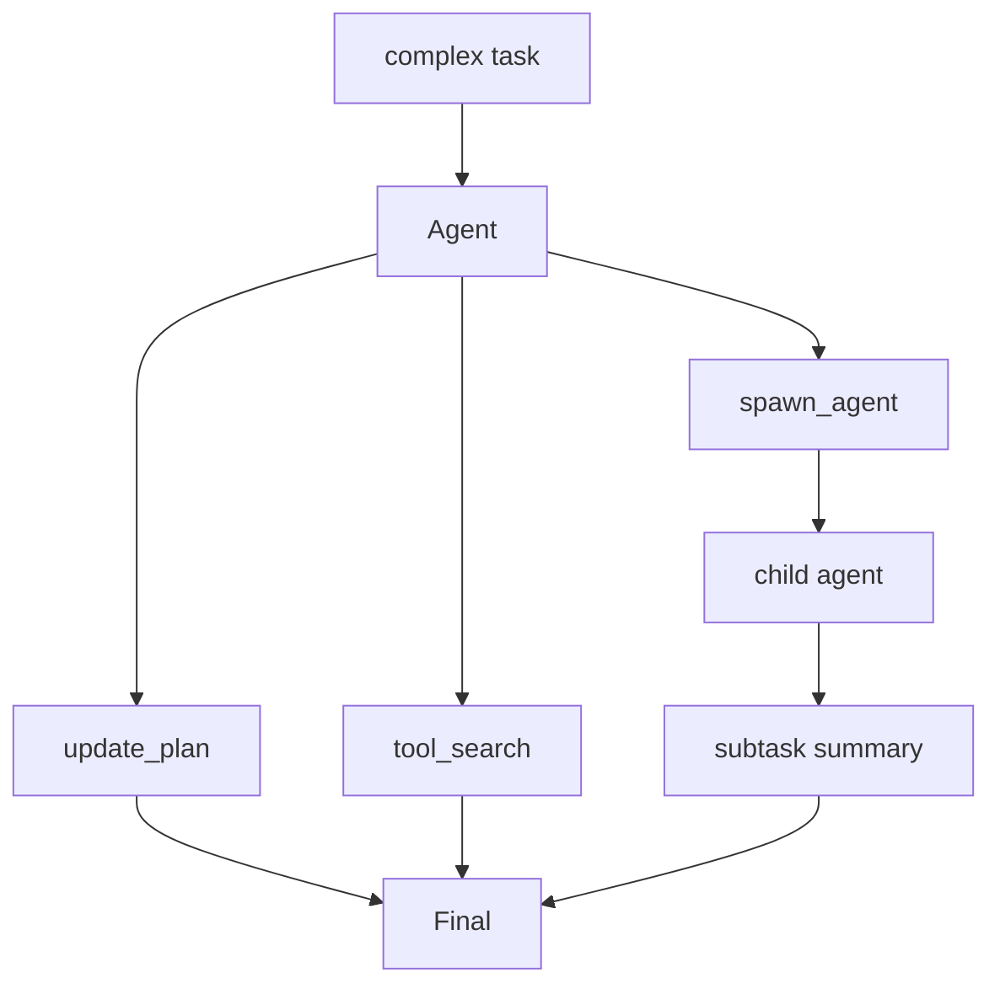

# Step 11: Multi-Agent Planning And Dynamic Tools

本章在 Step 10 的真实模型扩展系统上加入更接近 Codex 高级能力的结构：计划工具、动态工具搜索、子 agent。

## 本步目标

- `update_plan`：记录任务 checklist。
- `tool_search`：按关键词发现延迟加载工具。
- `spawn_agent`：启动一个简化子 agent 完成子任务。
- 展示并行/子任务思维，但保持代码可读。



## 解决的问题

真实任务经常不是一次 shell 或一次 patch 能完成的。Codex 需要：

- 把长任务拆成有状态计划。
- 按需暴露工具，避免模型上下文塞满。
- 用子 agent 探索、审查或并行处理局部问题。

## 源码映射

- plan tool：`codex-rs/core/src/tools/handlers/plan.rs`
- tool search handler：`codex-rs/core/src/tools/handlers/tool_search.rs`
- multi-agent handlers：`codex-rs/core/src/tools/handlers/multi_agents.rs` 与 `multi_agents_v2.rs`
- agent role/registry：`codex-rs/core/src/agent/*`
- task lifecycle：`codex-rs/core/src/tasks/*`

## 运行

```bash
export OPENAI_API_KEY="你的 API key"
export OPENAI_MODEL="你的模型名"
export OPENAI_BASE_URL="https://api.openai.com/v1"

python3 mini_codex.py exec "plan build a small feature"
python3 mini_codex.py exec "ask explorer inspect README"
python3 mini_codex.py exec "find tool reverse"
```

## 实现逻辑

这一步把 tool registry 拆成两层：

- 已加载工具：shell、patch、plan、spawn_agent。
- 可发现工具：通过 `tool_search` 查到后再注册。

`spawn_agent` 会创建一个 child `Agent`，给它独立历史和 role，然后把摘要作为工具结果返回父 agent。`tool_search` 会修改本地 tool registry，下一次模型请求时才把新工具 schema 暴露给模型。

## 下一步

最后一步会把前面所有结构收束成一个完整教学版 Codex CLI：配置、auth stub、exec/tui/server、持久化、工具、扩展、review、compact 都放在同一个可运行程序里。
