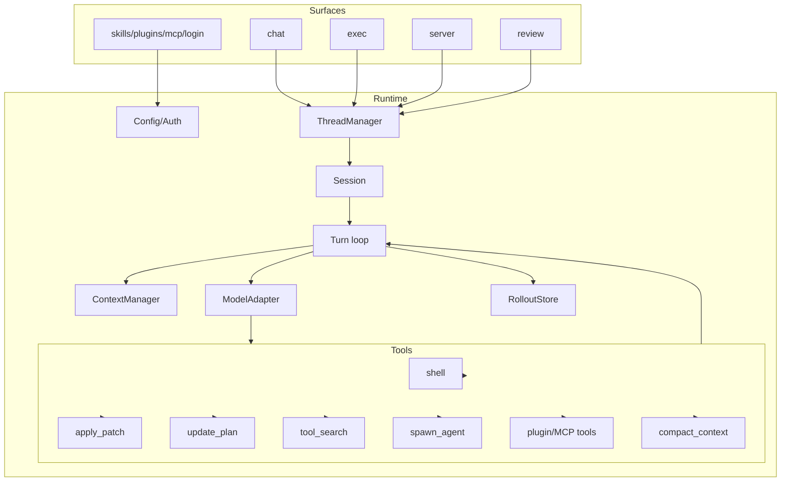

# Step 12: Complete Mini Codex

本章汇总前 11 步，得到一个“完整教学版 Codex”。它覆盖真实 Codex CLI 的主要功能类别：多入口、thread/session/turn、模型适配、上下文、工具、审批、沙箱、持久化、app-server、exec/TUI、MCP/skills/plugins、计划、多 agent、动态工具、review、compact。

## 本步目标

- 用一个程序串起全部运行链路。
- 保持代码短小，但每类功能都有可运行路径。
- 明确每个教学实现对应真实 Codex 的源码位置。



## 功能覆盖表

| Codex 功能类别 | 教学版实现 | 真实源码锚点 |
| --- | --- | --- |
| CLI 分发 | `chat`、`exec`、`server`、`review` 子命令 | `codex-rs/cli/src/main.rs` |
| app-server 协议 | JSON Lines RPC | `codex-rs/app-server/src/message_processor.rs` |
| thread/session/turn | `ThreadManager`、`Agent`、`run_turn` | `codex-rs/core/src/thread_manager.rs`、`session/*` |
| 模型流 | `OpenAIChatModel` + OpenAI-compatible `tool_calls` | `codex-rs/core/src/client.rs`、`session/turn.rs` |
| context | AGENTS.md、env、history cap、skills catalog | `codex-rs/core/src/context/*` |
| shell/patch | `shell`、`apply_patch` 工具 | `codex-rs/core/src/tools/handlers/*` |
| approvals/sandbox | policy check + workspace path guard | `codex-rs/protocol/src/approvals.rs`、`core/src/sandboxing` |
| rollout/resume | JSONL store | `codex-rs/rollout`、`thread-store` |
| skills/plugins/MCP | local manifests and generated tools | `core-skills`、`core-plugins`、`codex-mcp` |
| plan/dynamic/subagent | `update_plan`、`tool_search`、`spawn_agent` | `core/src/tools/handlers/plan.rs`、`multi_agents*` |
| review/compact | simplified review and compaction commands | `core/src/tasks/review.rs`、`compact*.rs` |

## 运行

```bash
export OPENAI_API_KEY="你的 API key"
export OPENAI_MODEL="你的模型名"
export OPENAI_BASE_URL="https://api.openai.com/v1"

python3 mini_codex.py init-sample-extension --codex-home /tmp/mini-codex-full
python3 mini_codex.py exec --codex-home /tmp/mini-codex-full "plan build a feature"
python3 mini_codex.py exec --codex-home /tmp/mini-codex-full "reverse abc"
python3 mini_codex.py review --codex-home /tmp/mini-codex-full .
python3 mini_codex.py threads --codex-home /tmp/mini-codex-full
```

server 模式：

```bash
export OPENAI_API_KEY="你的 API key"
export OPENAI_MODEL="你的模型名"
export OPENAI_BASE_URL="https://api.openai.com/v1"

printf '{"id":1,"method":"thread/start","params":{"cwd":"."}}\n{"id":2,"method":"turn/start","params":{"threadId":"LAST","input":"run echo hi"}}\n' | python3 mini_codex.py server
```

## 实现逻辑

`mini_codex.py` 按真实 Codex 的层次组织：

1. 数据模型：`Message`、`Event`、`ToolCall`、`ToolResult`。
2. 配置与权限：`Config`、`PermissionPolicy`。
3. 上下文：`ContextManager`。
4. 工具：`ToolRegistry` 和一组 handler。
5. 模型：`OpenAIChatModel`，使用 OpenAI-compatible Chat Completions 和 `tools/tool_calls`。
6. 会话：`Agent.run_turn()`。
7. 持久化：`RolloutStore`。
8. 入口：`chat`、`exec`、`server`、`review`、管理命令。

教学版没有实现跨平台强 sandbox、TUI ratatui 渲染、schema 生成、远程环境和云端认证；但每个位置都留下了清楚的替换点。

## 继续扩展

你可以把 `OpenAIChatModel` 换成真实 Responses API adapter，把 `PluginTool` 换成 MCP stdio client，把 `chat` 换成 curses/文本 UI。到这一步，架构已经和 Codex 的主干同构：前端只提交 turn，runtime 统一管理上下文、工具、权限和历史。
