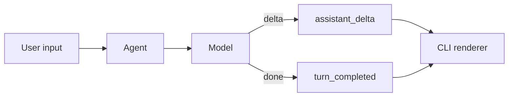

# Step 2: Streaming Events

本章在 Step 1 的真实模型基础 loop 上加入事件流。Codex 的 UI 不是等整个 turn 结束才刷新，而是不断接收“文本增量、工具开始、工具结束、完成”等事件。

## 本步目标

- 引入 `Event`。
- 把 assistant 文本拆成 `assistant_delta` 事件。
- 让 REPL 和 `--once` 共用同一套事件消费逻辑。



## 解决的问题

没有事件流时，终端只能等最终结果。加入事件后，runtime 可以把内部过程稳定地暴露给不同前端：

- TUI 可以逐字渲染。
- `exec --jsonl` 可以输出机器可读事件。
- app-server 可以把 core event 映射成 notification。

## 源码映射

- 模型流事件：`codex-rs/core/src/session/turn.rs` 中处理 `ResponseEvent::*`。
- 流事件工具函数：`codex-rs/core/src/stream_events_utils.rs`。
- exec 事件输出：`codex-rs/exec/src/event_processor_with_jsonl_output.rs` 与 human output processor。
- TUI 流式显示：`codex-rs/tui/src/chatwidget/streaming.rs`。

## 运行

```bash
export OPENAI_API_KEY="你的 API key"
export OPENAI_MODEL="你的模型名"
export OPENAI_BASE_URL="https://api.openai.com/v1"

python3 mini_codex.py --once "explain streaming"
python3 mini_codex.py --jsonl --once "hello"
```

`--jsonl` 会打印结构化事件，类似 Codex headless/exec 模式常见的输出形态。

## 实现逻辑

`Agent.turn_events()` 返回一个生成器。调用方不再直接拿字符串，而是一边迭代事件一边渲染。`OpenAIChatModel.stream()` 读取 OpenAI 兼容的 streaming response，把每个 `delta.content` 转成 `assistant_delta`。最终 assistant 消息仍然会写入历史，保证下一轮可以看到之前的上下文。

## 下一步

事件流只会说话，还不会行动。下一章会加入第一个工具：shell。
