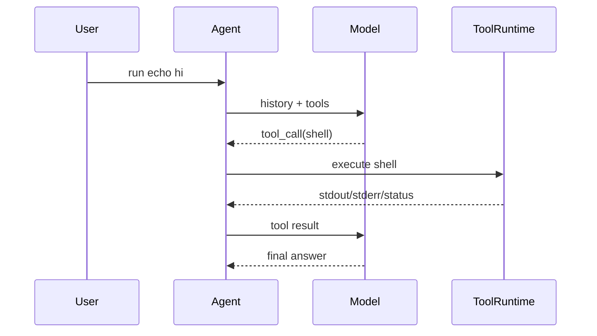

# Step 3: Shell Tools

本章在 Step 2 的真实模型事件流上加入 Codex 最核心的能力之一：模型可以通过 OpenAI 标准 `tool_calls` 请求 runtime 执行 shell 命令，然后把输出交还给模型继续思考。

## 本步目标

- 定义 `ToolCall` 和 `ToolResult`。
- 实现 `shell` 工具。
- 让模型先发起工具调用，再根据工具结果给最终回答。



## 解决的问题

LLM 本身不能读取文件系统或执行命令。Codex 的做法是：模型只“提出工具调用”，真正执行由本地 runtime 完成。这样可以加入权限、安全、日志、事件和持久化。

## 源码映射

- 工具规划：`codex-rs/core/src/tools/spec_plan.rs`
- 工具路由：`codex-rs/core/src/tools/router.rs`
- 工具 runtime：`codex-rs/core/src/tools/registry.rs`、`codex-rs/core/src/tools/parallel.rs`
- shell handler：`codex-rs/core/src/tools/handlers/shell.rs`
- exec 协调：`codex-rs/core/src/exec.rs`

## 运行

```bash
export OPENAI_API_KEY="你的 API key"
export OPENAI_MODEL="你的模型名"
export OPENAI_BASE_URL="https://api.openai.com/v1"

python3 mini_codex.py --once "run echo hello"
python3 mini_codex.py --jsonl --once "pwd"
```

## 实现逻辑

`OpenAIChatModel.stream_action()` 会把 `history` 和工具 schema 一起发给模型，并用 streaming response 同时接收文本增量和 OpenAI 兼容的 `tool_calls`。模型要行动时，runtime 解析为 `ToolCall(name="shell")` 并执行。`Agent.turn_events()` 持续循环：

1. 请求模型下一步动作。
2. 如果是 final，结束。
3. 如果是 tool call，执行工具，记录工具结果。
4. 回到第 1 步。

这个循环就是 Codex `run_turn` 的最小形态。

## 下一步

能执行 shell 后，agent 还需要能可靠地改文件。下一章会加入 `apply_patch`。
