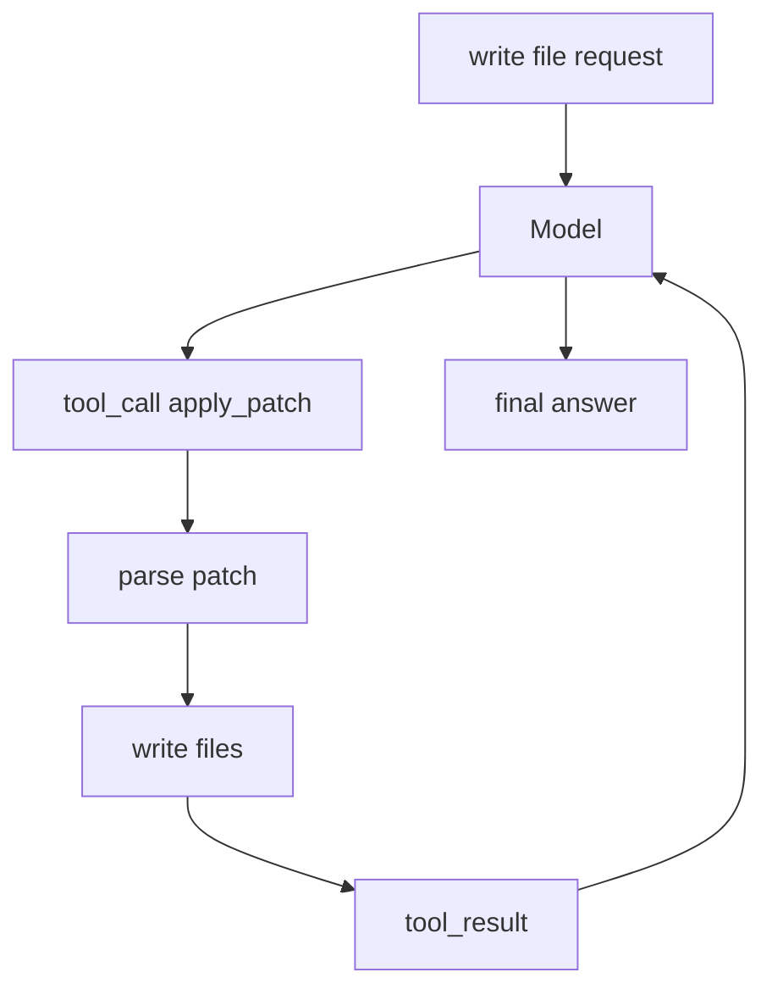

# Step 4: File Editing With Apply Patch

本章在 Step 3 的真实工具调用 loop 上加入文件编辑工具。Codex 真实实现中，模型通常用 `apply_patch` 产生结构化补丁，而不是直接用 shell 重定向覆盖文件。

## 本步目标

- 实现简化版 `apply_patch`。
- 支持新增、删除、更新文件。
- 把文件变更作为工具结果回灌给模型。



## 为什么需要 patch 工具

用 shell 写文件有几个问题：

- 很难审查到底改了什么。
- 引号和跨平台 shell 差异会污染 agent 逻辑。
- 权限系统无法轻易判断文件变更范围。

结构化 patch 可以把“模型意图”转成可解析、可审计、可持久化的文件修改。

## 源码映射

- apply patch 工具 handler：`codex-rs/core/src/tools/handlers/apply_patch.rs`
- patch parser/执行：`codex-rs/apply-patch`
- 工具事件和历史：`codex-rs/core/src/tools/events.rs`、`codex-rs/protocol/src/protocol.rs`
- TUI diff 渲染：`codex-rs/tui/src/diff_render.rs`

## 运行

```bash
export OPENAI_API_KEY="你的 API key"
export OPENAI_MODEL="你的模型名"
export OPENAI_BASE_URL="https://api.openai.com/v1"

python3 mini_codex.py --cwd /tmp/mini-codex-step4 --once "write hello.txt Hello from patch"
python3 mini_codex.py --cwd /tmp/mini-codex-step4 --once "show hello.txt"
```

## 实现逻辑

教学版 patch 格式保留 Codex 风格的边界：

```text
*** Begin Patch
*** Add File: hello.txt
+Hello
*** End Patch
```

模型通过 OpenAI `tool_calls` 选择 `shell` 或 `apply_patch`。`apply_patch()` 会解析每个文件操作，并限制路径必须留在 `--cwd` 下面。现在还没有审批策略，下一章会加入。

## 下一步

工具能修改机器后，就必须有权限系统。下一章加入 approval policy 和 sandbox mode。
