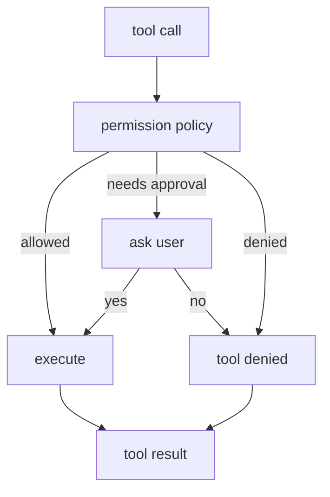

# Step 5: Approvals And Sandbox

本章给 shell 和 patch 加上审批与沙箱。真实 Codex 的安全边界比教学版复杂得多，但核心问题一样：模型想执行动作，不代表 runtime 应该无条件执行。

## 本步目标

- 引入 `ApprovalPolicy`：`never`、`on-request`。
- 引入 `SandboxMode`：`read-only`、`workspace-write`、`danger-full-access`。
- 对 shell 和 patch 做策略检查。



## 解决的问题

Codex 的模型输出是不可信的本地意图。审批和沙箱把“模型想做什么”和“用户允许做什么”分开：

- read-only 模式禁止文件写入。
- workspace-write 只允许改工作区内文件。
- danger-full-access 才跳过工作区限制。
- 危险 shell 命令需要审批或直接拒绝。

## 源码映射

- 审批协议类型：`codex-rs/protocol/src/approvals.rs`
- sandbox 配置：`codex-rs/core/src/sandboxing/mod.rs`
- shell 权限路径：`codex-rs/core/src/tools/handlers/shell.rs`
- MCP 审批路径：`codex-rs/core/src/mcp_tool_call.rs`
- TUI 审批 UI：`codex-rs/tui/src/bottom_pane/approval_overlay.rs`

## 运行

```bash
python3 mini_codex.py --approval never --sandbox workspace-write --once "run echo safe"
python3 mini_codex.py --approval never --sandbox read-only --once "write blocked.txt no"
```

交互模式下使用 `--approval on-request` 时，危险命令会询问是否允许。

## 实现逻辑

`PermissionPolicy.check()` 返回三种结果：

- `allow`：直接执行。
- `ask`：根据 approval policy 询问用户。
- `deny`：返回工具拒绝结果。

这对应真实 Codex 的 tool registry + approval request + UI response 管线。

## 下一步

工具和权限只是 runtime 的一半。模型还需要看到项目指令、当前目录、可用能力等上下文。下一章加入 context manager 和 `AGENTS.md`。
