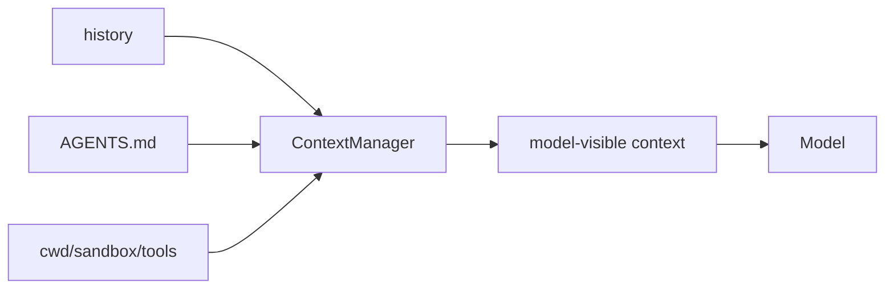

# Step 6: Context And Instructions

本章实现模型上下文层：除了历史消息，agent 还要把项目指令、环境摘要、权限状态、可用工具等信息交给模型。

## 本步目标

- 加载当前目录向上的 `AGENTS.md`。
- 构造 bounded context，避免无限增长。
- 提供 `/context` 命令查看模型可见摘要。



## 解决的问题

没有上下文层时，模型只知道用户当前说了什么，不知道：

- 当前工作目录在哪里。
- 项目对代码风格、测试、权限有什么要求。
- runtime 提供哪些工具。
- 历史过长时应该保留哪些内容。

Codex 的关键设计是把这些模型可见信息做成有边界的 fragment，而不是随手拼接无限字符串。

## 源码映射

- AGENTS.md 加载：`codex-rs/core/src/agents_md.rs`
- context fragments：`codex-rs/core/src/context/*`
- 初始上下文构建：`codex-rs/core/src/session/mod.rs`
- 增量上下文更新：`codex-rs/core/src/context_manager/updates.rs`
- 历史管理：`codex-rs/core/src/context_manager/history.rs`

## 运行

```bash
mkdir -p /tmp/mini-codex-step6
printf 'Always answer with short sentences.\n' > /tmp/mini-codex-step6/AGENTS.md
python3 mini_codex.py --cwd /tmp/mini-codex-step6 --once "context please"
python3 mini_codex.py --cwd /tmp/mini-codex-step6
```

REPL 中输入 `/context` 查看本轮会提供给模型的上下文。

## 实现逻辑

`ContextManager.build()` 汇总四类信息：

1. system instructions。
2. AGENTS.md 内容。
3. environment context。
4. 最近历史。

教学版用字符数限制模拟真实 Codex 的 token cap。

## 下一步

现在 thread 还只存在内存里。下一章加入 rollout JSONL，支持 list/resume。
