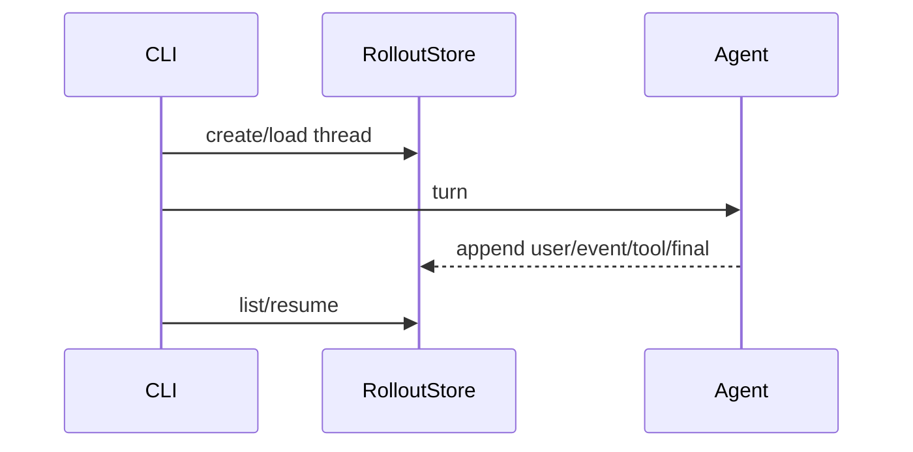

# Step 7: Persistence And Resume

本章在 Step 6 的真实模型上下文层上实现会话持久化。Codex 的一次会话不是临时聊天，而是一条可以恢复、fork、审计的 thread。

## 本步目标

- 引入 `thread_id`。
- 把事件写入 JSONL rollout。
- 支持 `--list` 和 `--resume THREAD_ID`。



## 解决的问题

没有持久化时：

- TUI 关闭后历史丢失。
- exec 无法回看完整过程。
- app-server 无法 resume/fork。
- 测试难以断言历史和工具输出。

Codex 使用 JSONL rollout 保存 canonical items，并用 SQLite/thread-store 做索引和快速查询。教学版先实现 JSONL。

## 源码映射

- rollout writer：`codex-rs/rollout/src/recorder.rs`
- thread store live writer：`codex-rs/thread-store/src/local/live_writer.rs`
- resume/fork：`codex-rs/core/src/thread_manager.rs`
- rollout reconstruction：`codex-rs/core/src/session/rollout_reconstruction.rs`
- TUI resume picker：`codex-rs/tui/src/resume_picker.rs`

## 运行

```bash
export OPENAI_API_KEY="你的 API key"
export OPENAI_MODEL="你的模型名"
export OPENAI_BASE_URL="https://api.openai.com/v1"

python3 mini_codex.py --codex-home /tmp/mini-codex-home --once "hello"
python3 mini_codex.py --codex-home /tmp/mini-codex-home --list
python3 mini_codex.py --codex-home /tmp/mini-codex-home --resume THREAD_ID --once "show history"
```

## 实现逻辑

`RolloutStore` 把每条记录写成一行 JSON：

- `thread_started`
- `user_message`
- `event`
- `assistant_message`

恢复时读取 JSONL，重建 `history`。因为真实 OpenAI tool calling 要求 `assistant.tool_calls` 与后续 `tool.tool_call_id` 配对，教学版也会把这些字段写入 rollout。这就是 Codex resume 的最小版本。

## 下一步

多个入口都需要复用同一个 runtime。下一章会把 agent 包装成 app-server 风格的 JSON-RPC 协议。
