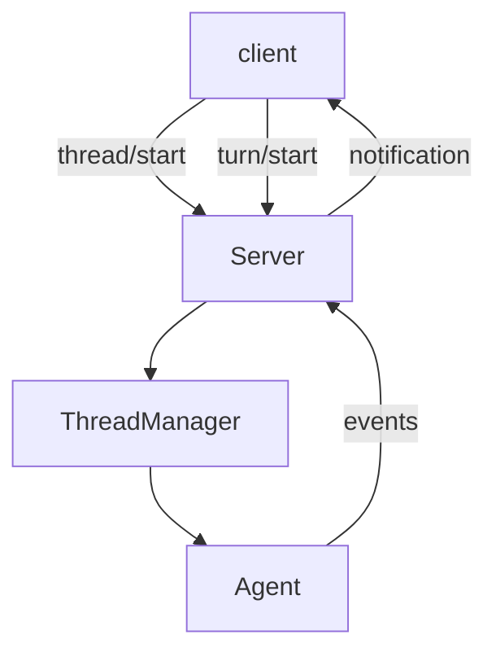

# Step 8: App-Server Protocol

本章在 Step 7 的可恢复真实模型 runtime 上加入一个很小的 app-server。真实 Codex 的 TUI、exec、IDE/桌面客户端都通过 app-server 风格的协议进入 core runtime。

## 本步目标

- 实现 JSON Lines RPC server。
- 支持 `thread/start`、`turn/start`、`thread/read`、`thread/list`。
- 将 runtime 事件转成 server notification。



## 解决的问题

如果 TUI、exec、IDE 都直接调用 core，会出现三份启动、配置、事件处理逻辑。app-server 协议让上层只关心 request/response/notification。

## 源码映射

- app-server message processor：`codex-rs/app-server/src/message_processor.rs`
- thread processor：`codex-rs/app-server/src/request_processors/thread_processor.rs`
- turn processor：`codex-rs/app-server/src/request_processors/turn_processor.rs`
- v2 protocol：`codex-rs/app-server-protocol/src/protocol/v2`
- in-process client：`codex-rs/app-server-client/src/lib.rs`

## 运行

```bash
export OPENAI_API_KEY="你的 API key"
export OPENAI_MODEL="你的模型名"
export OPENAI_BASE_URL="https://api.openai.com/v1"

printf '{"id":1,"method":"thread/start","params":{"cwd":"/tmp/mini-codex-step8"}}\n{"id":2,"method":"turn/start","params":{"threadId":"LAST","input":"run echo hi"}}\n' | python3 mini_codex.py server
```

教学版支持特殊 thread id `LAST`，便于 shell 演示。

## 实现逻辑

`MiniAppServer.handle()` 做方法分发。`ThreadManager` 管理多个 `Agent` 实例。每个 request 输出一条 response；turn 执行过程中额外输出 notification。`thread/start` 本身不需要模型请求，`turn/start` 才会按环境变量或 CLI 参数创建 OpenAI-compatible model adapter。

## 下一步

有了统一协议后，可以在上面接不同入口。下一章加入 `exec` 和一个 TUI-lite。
