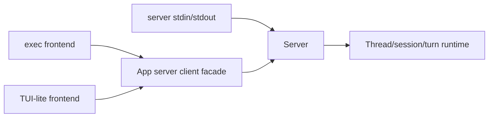

# Step 9: Exec And TUI Frontends

本章在 Step 8 的真实模型 app-server 上实现两个前端：非交互 `exec` 和交互式 `tui`。它们共享同一个 runtime，只是事件呈现方式不同。

## 本步目标

- `exec PROMPT`：运行一次 turn，适合脚本和 CI。
- `tui`：持续交互，显示 thread id 和历史。
- 保留 `server`：JSON-RPC 风格入口继续可用。



## 解决的问题

Codex 产品里有多个入口，但不应该有多个 agent 实现。真实 Codex 中：

- `codex exec` 用于 headless 自动化。
- 默认 `codex` 进入 TUI。
- `codex app-server` 面向 IDE/桌面/远程客户端。

教学版把这些入口放在一个 Python 文件里。

## 源码映射

- 顶层 CLI 分发：`codex-rs/cli/src/main.rs`
- exec 入口：`codex-rs/exec/src/lib.rs`
- TUI 启动：`codex-rs/tui/src/lib.rs`
- TUI 与 app-server session：`codex-rs/tui/src/app_server_session.rs`
- app-server in-process client：`codex-rs/app-server-client/src/lib.rs`

## 运行

```bash
export OPENAI_API_KEY="你的 API key"
export OPENAI_MODEL="你的模型名"
export OPENAI_BASE_URL="https://api.openai.com/v1"

python3 mini_codex.py exec "run echo from-exec"
python3 mini_codex.py tui
python3 mini_codex.py server
```

## 实现逻辑

`MiniClient` 是一个内存版 app-server client。`exec_main()` 和 `tui_main()` 都只通过它调用 `thread/start` 与 `turn/start`，不直接碰工具和模型。模型配置仍然来自 `OPENAI_*` 环境变量，也可以通过各前端上的 `--model`、`--base-url` 等参数覆盖。

## 下一步

Codex 的能力不只来自内置工具，还来自 MCP、skills、plugins、apps/connectors。下一章加入扩展系统。
