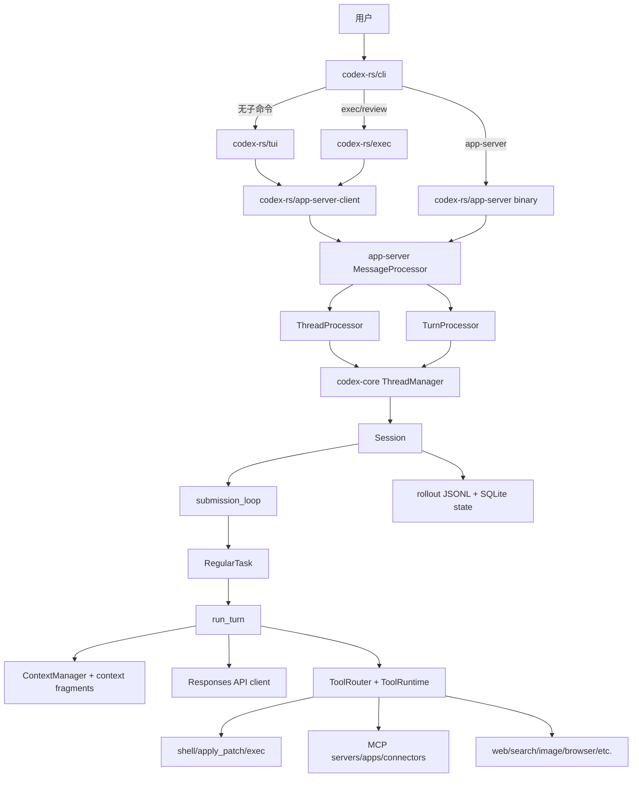
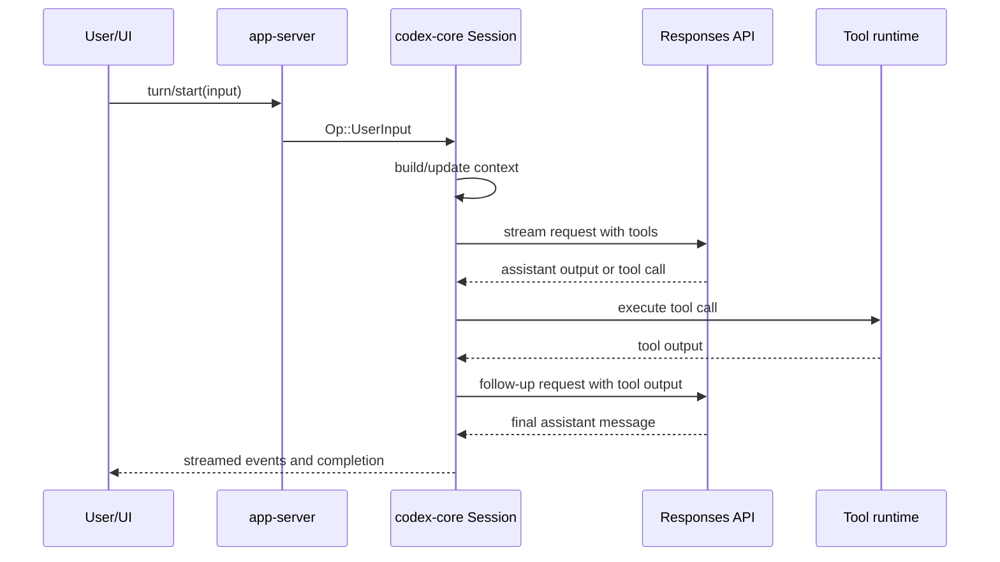
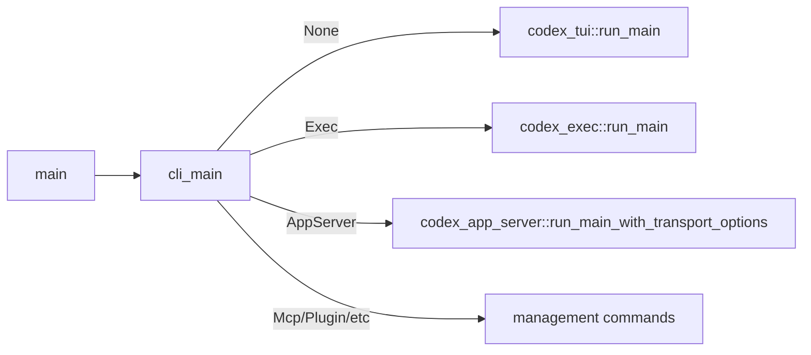
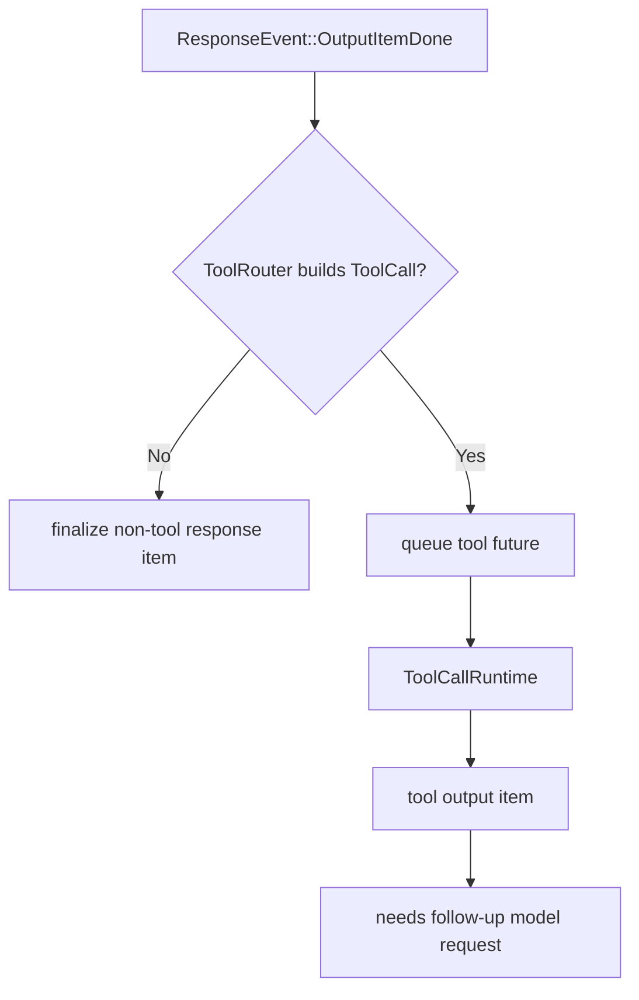

# Codex 源码实现解析：从 agent 概念到运行时主干

生成日期：2026-06-18  
仓库：`/Users/xiaodong/Desktop/learn/codex`  
阅读对象：对 agent 有粗略概念，想通过源码理解 Codex 如何实现 CLI/TUI/app-server、上下文、模型调用、工具执行、MCP、skills/plugins、sandbox、持久化与测试的人。

## 0. 先给一张地图

一句话：Codex 不是“一个 main 函数里 while 调模型”的程序，而是一个多入口 agent runtime。

主干可以按四层理解：

1. 入口层：`cli`、`tui`、`exec`、`app-server` 接受用户请求。
2. 协议层：app-server v2 把不同入口统一成 `thread/start`、`turn/start` 这类 RPC。
3. agent runtime：`codex-core` 维护 thread/session/turn、上下文、模型流和工具运行。
4. integrations：模型 API、shell/sandbox、MCP、plugins、skills、持久化、telemetry、测试环境。

本文没有使用外部网页，主要依据当前仓库源码、README、`AGENTS.md` 和本地扫描结果。相关仓库知识卡片见 `docs/codebase/`。

## 1. Agent 基本概念如何落到 Codex 源码

先用最小 mental model：

- Thread：一条可恢复的会话线，类似“项目里的一个持续工作流”。
- Turn：一次用户输入触发的一轮 agent 工作，可能包含多次模型采样和多次工具调用。
- Context：发给模型的历史与环境说明，包括用户消息、AGENTS.md、权限、cwd、skills、工具规格等。
- Tool：模型可以请求 Codex 执行的能力，例如 shell、apply_patch、MCP tool。
- Rollout：会话历史的持久化 JSONL，用于 resume/fork/list。
- App-server：把 UI/IDE/CLI 的请求变成统一的 thread/turn 协议。

源码对应：

- `ThreadStartParams`：`codex-rs/app-server-protocol/src/protocol/v2/thread.rs:52`
- `TurnStartParams`：`codex-rs/app-server-protocol/src/protocol/v2/turn.rs:67`
- `Session`：`codex-rs/core/src/session/session.rs:23`
- `SessionConfiguration`：`codex-rs/core/src/session/session.rs:49`
- `run_turn`：`codex-rs/core/src/session/turn.rs:126`
- `ToolRouter`：`codex-rs/core/src/tools/router.rs:35`
- `RolloutRecorder`：`codex-rs/rollout/src/recorder.rs:66`

一个普通 turn 的主干是：

这里最重要的设计点是：Codex 把“模型想做事”变成工具调用输出，再把工具输出作为下一次模型输入。也就是说，agent 的行动能力不是模型自己执行的，而是 Codex runtime 解释模型输出、检查权限、执行工具、记录结果，然后继续采样。

## 2. 入口层：用户从哪里进来

### 2.1 `codex-rs/cli` 是总入口

`codex-rs/cli/src/main.rs:123` 定义 `Subcommand`。这个枚举能看出产品形态：

- 无子命令：进入交互式 TUI。
- `exec` / `review`：非交互执行或代码审查路径。
- `app-server`：启动面向富客户端的协议服务。
- `mcp`、`plugin`：管理 MCP 和插件。
- `login`、`logout`、`doctor`、`sandbox`、`debug` 等运维入口。

真正的分发在 `codex-rs/cli/src/main.rs:963` 的 `cli_main`。无子命令时会走 `run_interactive_tui`，位置在 `codex-rs/cli/src/main.rs:2221`。

主干：

这些分支解决的问题是：同一个原生二进制可以承载交互式、脚本式、服务式和管理式工作流，但后面的 agent 逻辑尽量统一复用。

### 2.2 TUI 不直接跑 agent loop，而是启动 app-server client

`codex-rs/tui/src/lib.rs:844` 的 `run_main` 做大量启动准备：

- 合并 CLI flags、config profile、sandbox/approval 设置。
- 处理 `--search`、云配置、本地 app-server daemon。
- 创建环境管理器。
- 选择 embedded/local/remote app-server target。

`codex-rs/tui/src/lib.rs:457` 的 `start_app_server` 会根据 target 创建 `AppServerClient`。embedded 模式最终走 `start_embedded_app_server_with`，在 `codex-rs/tui/src/lib.rs:520` 构造 `InProcessClientStartArgs`。

这层代码解决的问题是：TUI 只关心“我如何和一个 app-server 通信”，不直接手写 thread/turn 的底层实现。这样 TUI、exec、外部 app 都可以共享 app-server 语义。

### 2.3 `exec` 是 headless agent 客户端

非交互模式在 `codex-rs/exec/src/lib.rs:238` 的 `run_main`。它解析命令行、构造 config、设置默认审批策略、初始化 state DB，然后也启动 `InProcessAppServerClient`。

`codex-rs/exec/src/lib.rs:760` 的 `run_exec_session` 做三件事：

1. start 或 resume thread；
2. submit 初始 `turn/start`；
3. 消费 app-server 通知，把最终结果输出到 stdout 或 JSONL。

这里和 TUI 的差别主要在 UI：TUI 是长期交互，exec 是一次性执行；但它们共享同一套 app-server 与 core runtime。

### 2.4 app-server binary 面向外部富客户端

`codex-rs/app-server/src/main.rs:1` 是独立 binary。它解析 `--listen`、auth、strict config、remote control 等参数，调用 `run_main_with_transport_options`。

`codex-rs/app-server/src/lib.rs:434` 的启动路径负责：

- 加载 codex home 和 config；
- 初始化 `EnvironmentManager`、`ConfigManager`、`AuthManager`；
- 初始化 state DB；
- 设置 telemetry；
- 建立 transport；
- 创建 `MessageProcessor`。

这使 Codex 可以被 VSCode/桌面 app/其他进程当成一个本地 agent 服务使用。

## 3. app-server：把各种客户端统一成 RPC

app-server 的核心角色是“协议边界”。它把外部请求转成内部 core 调用，并把 core events 转成 server notifications。

### 3.1 协议类型

`codex-rs/app-server-protocol/src/protocol/common.rs:209` 生成 `ClientRequest`。从类型上可以看到 app-server v2 的资源方法：

- `thread/start`
- `thread/resume`
- `thread/fork`
- `turn/start`
- `turn/interrupt`
- `config/*`
- `mcp/*`
- `plugin/*`
- `app/*`

`ThreadStartParams` 在 `codex-rs/app-server-protocol/src/protocol/v2/thread.rs:52`，包含 model/provider/cwd/workspace roots/approval/sandbox/permissions/config/personality/environment/dynamic tools 等。

`TurnStartParams` 在 `codex-rs/app-server-protocol/src/protocol/v2/turn.rs:67`，包含 input、additional_context、cwd/envs、approval/sandbox 覆盖、model/effort/personality/output_schema/collaboration_mode 等。

这个 payload 很宽，是因为 Codex 允许不同入口在 thread 级或 turn 级动态覆盖运行环境。

### 3.2 MessageProcessor 是 app-server 的路由中枢

`codex-rs/app-server/src/message_processor.rs:185` 的 `MessageProcessor` 持有一组 request processor：account、apps、config、environment、feedback、fs、git、initialize、marketplace、mcp、plugin、thread、turn 等。

`codex-rs/app-server/src/message_processor.rs:926` 附近是请求分发。关键分支：

- `ClientRequest::ThreadStart` 在 `codex-rs/app-server/src/message_processor.rs:1075` 转给 `ThreadRequestProcessor`。
- `ClientRequest::TurnStart` 在 `codex-rs/app-server/src/message_processor.rs:1300` 转给 `TurnRequestProcessor`。

这层解决的问题是：app-server 需要同时支持很多 API，但每个领域的逻辑不应该都堆在 transport 层。`MessageProcessor` 统一收发和鉴权/初始化，具体业务交给 processor。

### 3.3 ThreadProcessor：创建运行态 thread

`codex-rs/app-server/src/request_processors/thread_processor.rs:871` 的 `thread_start_inner` 做 thread 启动前处理：

- 解包 `ThreadStartParams`；
- 校验 sandbox 与 permissions 是否冲突；
- 解析 cwd、workspace roots、environment；
- 构造 config overrides；
- 初始化 extension/plugin 相关状态；
- spawn 后台任务。

真正开始 thread 的后台任务在 `codex-rs/app-server/src/request_processors/thread_processor.rs:1015`。它最终调用 `ThreadManager::start_thread_with_options`，见 `codex-rs/core/src/thread_manager.rs:582`。

Thread 启动成功后，它会返回 `ThreadStartResponse` 并发出 `ThreadStarted` notification。这让客户端可以先拿到 thread ID 和实际配置，再开始 turn。

### 3.4 TurnProcessor：把用户输入提交给 core

`codex-rs/app-server/src/request_processors/turn_processor.rs:381` 的 `turn_start_inner` 做：

- 找到目标 thread；
- 验证输入大小和 direct input 规则；
- 解析 per-turn cwd/env/approval/sandbox/model/personality/output_schema；
- 把 v2 input 映射成 core 的 `UserInput`；
- 构造 `Op::UserInput`；
- 调用 session submit。

主干是：app-server 不直接调用模型。它只把用户的 turn 变成 core session 的 `Op`，然后由 core 的 task/turn loop 继续。

## 4. core 的 thread/session：agent 的运行容器

### 4.1 ThreadManager：管理可运行 thread

`codex-rs/core/src/thread_manager.rs:172` 的 `ThreadManager` 持有跨 thread 的共享服务。`ThreadManagerState` 在 `codex-rs/core/src/thread_manager.rs:201`，可以看到它集中管理：

- auth；
- model manager；
- environment manager；
- skills service；
- plugins manager；
- MCP manager；
- extension registry；
- user instructions provider；
- thread store；
- state DB；
- attestation service。

`start_thread_with_options` 在 `codex-rs/core/src/thread_manager.rs:582`。它的职责不是跑 turn，而是创建一个 `CodexThread` 和它背后的 `Session`。

解决的问题：thread 是长期对象；它需要共享服务、持久化状态和事件订阅，而不是每个 turn 都从零开始。

### 4.2 Session：一条 thread 的运行态

`codex-rs/core/src/session/session.rs:23` 的 `Session` 是核心运行状态，字段包括：

- thread_id、installation_id；
- event sender；
- status；
- state；
- network proxy；
- MCP refresh state；
- realtime state；
- active turn；
- input queue；
- guardian/services。

`SessionConfiguration` 在 `codex-rs/core/src/session/session.rs:49`，描述这个 session 如何运行：模型 provider、collaboration mode、reasoning、developer/base/compact instructions、AGENTS.md、approval policy、permission profile、environment、workspace roots、dynamic tools、shell override 等。

`Session::new` 从 `codex-rs/core/src/session/session.rs:470` 开始。重要初始化步骤包括：

- 解析 shell 和 turn environments；
- 加载 project instructions / AGENTS.md，见 `codex-rs/core/src/session/session.rs:824`；
- warm plugins and skills，见 `codex-rs/core/src/session/session.rs:830`；
- 初始化 network proxy、hooks、warnings。

### 4.3 Session spawn 和初始上下文

`codex-rs/core/src/session/mod.rs:520` 附近负责 spawn session。它创建 channels、exec policy、models refresh、base instructions、`SessionConfiguration`，然后启动 submission loop。

`codex-rs/core/src/session/mod.rs:1222` 的 `record_initial_history` 处理 New/Resumed/Forked/Cleared thread 的历史恢复。

`codex-rs/core/src/session/mod.rs:2861` 的 `build_initial_context` 是非常关键的函数。它把一堆稳定上下文变成模型初始输入：

- model switch 信息；
- permissions/sandbox；
- developer instructions；
- collaboration mode；
- realtime/personality；
- apps、skills、recommended plugins；
- plugin capabilities；
- extension fragments；
- AGENTS.md/user instructions；
- token budget；
- environment/subagents；
- multi-agent hints。

这段代码解决的问题是：模型每个 turn 都需要知道“我在哪里、能做什么、规则是什么”。但它也解释了为什么仓库强调 model-visible context 必须有大小上限和缓存友好性。

## 5. 从 `Op::UserInput` 到 task

客户端提交 turn 后，core 不会立即在调用栈里同步跑完，而是把操作放进 session 的 submission channel。

### 5.1 submit

`codex-rs/core/src/session/mod.rs:694` 的 `submit` 接收 `Op`，封装成 bounded submission，发送给 session loop。

### 5.2 submission_loop

`codex-rs/core/src/session/handlers.rs:700` 的 `submission_loop` 匹配各种 `Op`：

- interrupt；
- realtime events；
- user input；
- settings updates；
- approval responses；
- dynamic tool responses；
- compact/rollback 等。

用户输入最终走 `user_input_or_turn_inner`，位置在 `codex-rs/core/src/session/handlers.rs:183`。这里会：

1. 创建新的 turn；
2. 发出 settings update；
3. 如果已有 active task，可能做 steering；
4. refresh MCP；
5. 合并 additional_context；
6. 构造 `TurnInput::UserInput`；
7. `spawn_task(..., RegularTask::new())`。

### 5.3 Task 生命周期

`codex-rs/core/src/tasks/mod.rs:202` 定义 `SessionTask` trait。注意它遵守仓库约定，使用返回 `impl Future + Send` 的形态，而不是 `async_trait`。

`codex-rs/core/src/tasks/mod.rs:319` 的 `start_task` 管理 active turn、task lifecycle、tokio task、rollout flush 和完成事件。

普通用户 turn 使用 `RegularTask`，入口在 `codex-rs/core/src/tasks/regular.rs:36`。它会：

- 发出 `TurnStarted`；
- 做预热；
- 循环调用 `run_turn`；
- 如果用户在模型运行期间追加输入，再把 pending input 带入下一轮。

这层 task 设计解决的问题是：turn 可能长时间运行、可能被打断、可能收到追加输入，还要保证持久化和 UI 事件顺序。

## 6. `run_turn`：Codex agent loop 的心脏

`codex-rs/core/src/session/turn.rs:126` 的注释已经说明核心循环：模型要么返回普通 assistant message，要么返回 tool call；tool output 会进入下一次 sampling。

### 6.1 run_turn 的主干

可以这样读：

1. 准备 turn context、client session、compaction、context updates。
2. 构建 skills/plugins 注入。
3. 构建工具列表和 tool router。
4. 调用模型 streaming。
5. 处理模型事件：文本、reasoning、tool call、completed。
6. 如果有工具输出，带着工具输出继续采样。
7. 如果模型结束且不需要 follow-up，完成 turn。

关键位置：

- setup：`codex-rs/core/src/session/turn.rs:140`
- main loop：`codex-rs/core/src/session/turn.rs:207`
- build prompt：`codex-rs/core/src/session/turn.rs:1024`
- run sampling request：`codex-rs/core/src/session/turn.rs:1049`
- build tools：`codex-rs/core/src/session/turn.rs:1153`
- stream event loop：`codex-rs/core/src/session/turn.rs:1860`

### 6.2 TurnContext：一轮运行需要的所有环境

`codex-rs/core/src/session/turn_context.rs:101` 的 `TurnContext` 包含：

- trace/sub_id；
- config/auth/model/provider/reasoning；
- session telemetry；
- cwd/date/timezone/client；
- developer/user/collaboration/personality；
- approval/permission/network/windows sandbox；
- tools/extensions/skills；
- timing。

`to_turn_context_item` 在 `codex-rs/core/src/session/turn_context.rs:358`，会把 cwd/workspace/current_date/timezone/approval/sandbox/network/model/personality/collaboration 等变成上下文 item。

这让模型能看到“当前 turn 的真实环境”，也让后续 diff update 有基准。

### 6.3 为什么一个 turn 里会多次请求模型

例子：

1. 用户说“修复测试”。
2. 模型请求 shell 工具：`rg`、`sed`、`just test`。
3. Codex 执行工具，把输出作为 `function_call_output`。
4. 模型看输出，可能请求 `apply_patch`。
5. Codex 应用补丁，再把结果返回。
6. 模型总结，turn 完成。

因此 `run_turn` 不是一次 API call，而是一个“模型输出 -> 工具执行 -> 工具输出 -> 模型继续”的循环。

## 7. 模型上下文：Codex 如何告诉模型“你是谁、在哪、能做什么”

上下文是 agent 行为的地基。Codex 把上下文拆成结构化片段，避免散落成拼字符串。

### 7.1 ContextualUserFragment

`codex-rs/core/src/context/mod.rs:1` 列出 context fragment 模块。`codex-rs/core/src/context/contextual_user_message.rs:20` 注册标准 contextual user fragments，例如：

- user instructions；
- environment context；
- additional context；
- skill instructions；
- user shell command；
- turn aborted；
- subagent notification；
- recommended plugins。

这些 fragment 实现 `ContextualUserFragment`，可以被渲染成模型消息。

### 7.2 AGENTS.md 如何加载

`codex-rs/core/src/agents_md.rs:1` 说明发现规则：从项目根到 cwd 收集 `AGENTS.md`，不会越过项目根。

关键函数：

- `load_project_instructions`：`codex-rs/core/src/agents_md.rs:48`
- `read_agents_md`：`codex-rs/core/src/agents_md.rs:96`
- `agents_md_paths`：`codex-rs/core/src/agents_md.rs:168`
- `LoadedAgentsMd::render`：`codex-rs/core/src/agents_md.rs:416`

这解决的问题是：不同目录可以有不同开发约束，模型需要知道当前工作目录适用哪些规则。

### 7.3 Environment context

`codex-rs/core/src/context/environment_context.rs:422` 从 `TurnContext` 构造环境上下文，包含：

- cwd；
- shell；
- current date；
- timezone；
- network access；
- filesystem roots/permission profile。

`diff_from_turn_context_item` 在 `codex-rs/core/src/context/environment_context.rs:380`，用于生成增量更新。

### 7.4 ContextManager

`codex-rs/core/src/context_manager/history.rs:32` 的 `ContextManager` 维护：

- 当前 items；
- history_version；
- token info；
- reference_context_item。

`for_prompt` 在 `codex-rs/core/src/context_manager/history.rs:107`，负责输出给模型的 prompt items。`estimate_token_count` 在 `codex-rs/core/src/context_manager/history.rs:130`。

`codex-rs/core/src/context_manager/updates.rs:214` 的 `build_settings_update_items` 生成设置变化后的模型上下文更新。

这层解决的问题是：长会话不能每次都重新塞一大坨系统说明；上下文要能增量变化、可估算、可持久化。

## 8. Skills、Plugins、Apps：Codex 如何扩展自己

### 8.1 Skills：先给目录，必要时注入全文

`codex-rs/core-skills/src/service.rs:53` 的 `SkillsService` 负责 skill discovery、snapshot、cache invalidation 和额外 roots。

`codex-rs/core-skills/src/render.rs:135` 的 `AvailableSkills` 渲染的是 skill 元数据目录，不是所有 `SKILL.md` 全文。

`codex-rs/core-skills/src/skill_instructions.rs:5` 描述 full skill instruction 的注入形态。

turn-time 逻辑在 `codex-rs/core/src/session/turn.rs:470` 的 `build_skills_and_plugins`。它会识别显式提到的 skills/plugins、extension injections、plugin injections，然后构建要放入模型上下文的 items。

为什么这么设计：

- 如果每个 turn 都塞全部 skill 全文，上下文会膨胀。
- 先给模型一个有预算的 skill catalog。
- 只有用户显式提及或 extension routing 需要时，再注入具体 `SKILL.md`。

### 8.2 Plugins：把 skills、MCP、apps、hooks 打包

`codex-rs/plugin/src/manifest.rs:3` 定义插件 manifest：

- name/version/description；
- paths；
- MCP servers；
- hooks；
- interface metadata。

`codex-rs/core-plugins/src/manager.rs:462` 的 `plugins_for_config` 根据配置加载插件。`effective_skill_roots_for_layer_stack` 在 `codex-rs/core-plugins/src/manager.rs:594`，把插件提供的 skill roots 接入 skills discovery。

插件解决的问题是：新能力不用都写进 `codex-core`，可以通过 manifest 暴露技能、MCP server、app、hook。

### 8.3 Apps/connectors 也是工具生态的一部分

apps/connectors 最终也会进入工具规划和 MCP runtime config。`codex-rs/core/src/mcp.rs:78` 会合并 config、plugins、apps、extension contributors。

`codex-rs/core/src/mcp_tool_call.rs:153` 附近有 app tool policy。也就是说，app 工具不是“特殊捷径”，仍然要走权限和 model-visible visibility 规则。

## 9. 模型 API：HTTP SSE 和 WebSocket 如何被统一

Codex 的模型 client 在 `codex-rs/core/src/client.rs`。文件头注释说明了两个层次：

- `ModelClient` 生命周期随 session；
- `ModelClientSession` 生命周期随 turn，负责 Responses WebSocket 和 turn state。

### 9.1 构造请求

`codex-rs/core/src/client.rs:782` 的 `build_responses_request` 把以下内容组织成 API 请求：

- instructions；
- formatted input；
- tools JSON；
- reasoning/include；
- verbosity/text output schema；
- prompt_cache_key；
- service_tier；
- metadata。

模型请求不是简单的 `{messages}`。Codex 需要把工具、推理配置、输出 schema、缓存 key、metadata 都放进去。

### 9.2 选择传输

`codex-rs/core/src/client.rs:1246` 走 HTTP Responses stream。  
`codex-rs/core/src/client.rs:1366` 走 Responses WebSocket。  
`codex-rs/core/src/client.rs:1610` 的 `stream` 会优先尝试 WebSocket，再 fallback 到 HTTP。

WebSocket 路径还会处理 prewarm、turn_state、previous_response_id、unauthorized recovery、upgrade required fallback 等。

### 9.3 ResponseEvent

`codex-rs/codex-api/src/common.rs:73` 的 `ResponseEvent` 是 core 消费的统一事件，包括：

- response created；
- output item added/done；
- completed；
- text delta；
- tool call input delta；
- reasoning delta；
- rate limits；
- model/server metadata。

SSE 映射在 `codex-rs/codex-api/src/sse/responses.rs:298`。

这解决的问题是：`run_turn` 不需要关心底层 event name 和 transport 差异，只需要处理统一 `ResponseEvent`。

## 10. Streaming 事件到工具执行

模型 streaming 中最重要的事件是“一个 output item done”。它可能是 assistant message，也可能是 tool call。

`codex-rs/core/src/stream_events_utils.rs:404` 的 `handle_output_item_done` 做判断：

- 如果 `ToolRouter` 能从 item 构造 tool call，就记录并排队执行工具；
- 如果不是工具，就 finalize assistant/reasoning/web 等普通响应 item；
- 如果解析失败，可能生成错误输出并要求 follow-up。

工具执行返回后，`run_turn` 会把 tool output 放进下一次 sampling input。

这层是 agent 行为的关键分叉：

## 11. 工具系统：从“模型看得到”到“系统真的执行”

### 11.1 工具规划：哪些工具给模型看

`codex-rs/core/src/tools/spec_plan.rs:167` 的 `build_tool_specs_and_registry` 决定本 turn 有哪些工具：

- built-in tools；
- MCP tools；
- hosted/model-side tools；
- dynamic tools；
- plugins/apps/extensions 提供的工具；
- 根据权限、配置、模型能力做 gating。

`build_tool_router` 在 `codex-rs/core/src/tools/spec_plan.rs:157`，把 specs 和 runtime registry 组装起来。

这解决的问题：工具不是固定列表。每个 turn 的 cwd、配置、模型、插件、MCP 状态、权限都可能影响模型能看到什么。

### 11.2 ToolRouter：把模型输出解析成 ToolCall

`codex-rs/core/src/tools/router.rs:112` 的 `build_tool_call` 处理不同输出形态：

- normal function call；
- tool search；
- custom tool call。

`ToolRouter` 的工作不是执行，而是把“模型输出 item”变成统一 `ToolCall`。

### 11.3 ToolCallRuntime：并行与取消

`codex-rs/core/src/tools/parallel.rs:31` 的 `ToolCallRuntime` 管理工具调用调度。

`handle_tool_call` 在 `codex-rs/core/src/tools/parallel.rs:62`，核心点是：

- 支持 parallel tool calls；
- 对 nonparallel 工具用写锁串行化；
- 响应取消；
- 关联 turn/tool source。

这解决的问题：模型可能同时请求多个可并行工具，但 shell/apply_patch 这类影响工作区的工具必须避免不安全并发。

### 11.4 CoreToolRegistry：统一权限、hooks、telemetry、结果

`codex-rs/core/src/tools/registry.rs:403` 的 `dispatch_any_with_terminal_outcome` 是工具执行通道。它大致做：

- 查找工具 executor；
- telemetry；
- 发送 tool started；
- pre-tool hooks；
- 可能 rewrite/block；
- 调用具体 executor；
- post-tool hooks；
- 附加 context；
- 发送 tool finished；
- 返回 tool output。

这层解决的问题：不管是 shell、apply_patch、MCP 还是别的工具，Codex 都能统一记录、审批、hook、通知和输出格式。

## 12. Shell、apply_patch、sandbox：真正改代码的路径

### 12.1 Shell command

`codex-rs/core/src/tools/handlers/shell/shell_command.rs:40` 的 `ShellCommandHandler` 把模型请求转成 exec params。

共享的执行路径在 `codex-rs/core/src/tools/handlers/shell.rs:60` 的 `run_exec_like`。它会：

- 解析环境和 filesystem；
- 计算 permissions；
- 拒绝不允许的 escalation；
- 拦截 apply_patch 风格调用；
- 发 tool start/finish events；
- 做 exec policy approval；
- 调用 orchestrator/runtime。

### 12.2 Sandbox exec

`codex-rs/core/src/sandboxing/mod.rs:42` 定义 `ExecRequest`。  
`codex-rs/core/src/exec.rs:331` 的 `build_exec_request` 根据 sandbox policy、平台、网络策略、cwd/env 等构造真正的进程执行请求。

仓库特别强调不要修改 sandbox 环境变量相关代码；`codex-rs/core/src/sandboxing/mod.rs:103` 会为 sandbox 子进程设置相关环境。

这解决的问题：模型可以请求命令，但命令必须被放进可控的工作目录、网络策略和平台 sandbox。

### 12.3 apply_patch

`codex-rs/core/src/tools/handlers/apply_patch.rs:327` 的 handler 解析 patch、检查权限、调用核心 apply_patch 逻辑，并发出 patch 事件。

为什么 apply_patch 是单独工具而不是普通 shell：

- 它能结构化验证 patch；
- 能按文件权限检查；
- 能生成更清晰的 UI/事件；
- 能避免模型用任意 shell trick 修改文件。

## 13. MCP：外部工具如何进入同一条工具管线

MCP 由三层组成。

### 13.1 Runtime config

`codex-rs/core/src/mcp.rs:78` 的 `runtime_config_with_context` 合并：

- 用户配置中的 MCP servers；
- plugin registrations；
- apps compatibility server；
- extension MCP contributors；
- auth/visibility overlays。

### 13.2 Connection manager

`codex-rs/codex-mcp/src/connection_manager.rs:106` 的 `McpConnectionManager` 持有运行中的 clients、metadata、required servers、provenance、apps cache、startup cancellation 等。

关键方法：

- `list_all_tools`：`codex-rs/codex-mcp/src/connection_manager.rs:446`
- `list_all_resources`：`codex-rs/codex-mcp/src/connection_manager.rs:542`
- `list_all_resource_templates`：`codex-rs/codex-mcp/src/connection_manager.rs:607`
- `call_tool`：`codex-rs/codex-mcp/src/connection_manager.rs:676`

### 13.3 Core handler

`codex-rs/core/src/tools/handlers/mcp.rs:32` 的 `McpHandler` 把 MCP tool 暴露成 core tool executor。

`codex-rs/core/src/mcp_tool_call.rs:109` 的 `handle_mcp_tool_call` 处理：

- 参数解析；
- metadata lookup；
- app tool policy；
- approval mode；
- disabled app tool blocking；
- started/approval events；
- 调用 MCP connection manager。

这套设计解决的问题：外部工具既要像内置工具一样可被模型调用，又不能绕过 Codex 的审批、可见性、事件和错误处理。

## 14. 持久化：为什么既有 JSONL 又有 SQLite

Codex 要支持 resume、fork、list、search、UI history 和调试，所以不能只把聊天记录留在内存。

### 14.1 Rollout JSONL

`codex-rs/rollout/src/recorder.rs:66` 的 `RolloutRecorder` 负责写 JSONL。

`record_canonical_items` 在 `codex-rs/rollout/src/recorder.rs:790`，把 canonical items 持久化。

`load_rollout_items` 在 `codex-rs/rollout/src/recorder.rs:846`，用于恢复历史。

JSONL 的好处：按时间保留完整会话事实，适合 replay/resume/debug。

### 14.2 SQLite state

`codex-rs/state/src/lib.rs:1` 表示 state crate 是 SQLite-backed metadata。  
`codex-rs/state/src/extract.rs:14` 根据 rollout item 更新 metadata。

SQLite 的好处：查询 thread 列表、索引、metadata 更高效。

### 14.3 Thread store live writer

`codex-rs/thread-store/src/local/live_writer.rs:77` 的 `append_items` 会 canonicalize items 并 flush rollout，使 SQLite 不领先于 JSONL。`sync_materialized_rollout_path` 在 `codex-rs/thread-store/src/local/live_writer.rs:159`，负责把 materialized rollout path 同步到 state DB。

这解决的问题：JSONL 是事实来源，SQLite 是索引/metadata；两者要尽量保持顺序和一致。

## 15. TUI 如何消费这些事件

TUI 的核心不是“直接调模型”，而是把 app-server notifications 转换成终端 UI 状态。

入口：

- `codex-rs/tui/src/lib.rs:844` 启动。
- `codex-rs/tui/src/app_server_session.rs:172` 的 `AppServerSession` 封装 thread/turn 请求。
- `codex-rs/tui/src/app_server_session.rs:431` 发送 `ThreadStart`。
- `codex-rs/tui/src/app_server_session.rs:748` 发送 `TurnStart`。

TUI 收到 notifications 后，会路由到 app/chatwidget/bottom pane/status 等模块更新展示。

这层解决的问题：UI 要显示 streaming 文本、工具运行状态、审批弹窗、pending input、history、diff、tokens、settings 等；它不应该承载 core agent 逻辑。

## 16. app-server API 为什么值得单独看

如果你把 Codex 当成“一个可以被其他应用嵌入的 agent runtime”，app-server v2 是最重要的边界。

核心文档在 `codex-rs/app-server/README.md`。源码边界：

- protocol common：`codex-rs/app-server-protocol/src/protocol/common.rs:209`
- v2 thread：`codex-rs/app-server-protocol/src/protocol/v2/thread.rs:52`
- v2 turn：`codex-rs/app-server-protocol/src/protocol/v2/turn.rs:67`
- schema tests：`codex-rs/app-server-protocol/tests/schema_fixtures.rs:11`

它解决的问题是：未来 VSCode、桌面 app、其他 IDE 或本地服务不需要嵌入 TUI，只需要实现 app-server transport 和 v2 request/notification。

## 17. 测试体系如何验证 agent 行为

### 17.1 `just test` 和 nextest

`justfile:71` 注释说明 `just test` 用 nextest 跑测试。`codex-rs/.config/nextest.toml:1` 配置重试、slow timeout、测试分组。

### 17.2 core 集成测试

`codex-rs/core/tests/suite/mod.rs:1` 聚合 core 集成测试。模块覆盖：

- agent execution；
- AGENTS.md；
- shell/apply_patch/unified exec；
- MCP/plugins/skills；
- prompt caching；
- resume/fork；
- tool parallelism；
- web search；
- model switching；
- token budget。

`codex-rs/core/tests/common/responses.rs:38` 的 `ResponseMock` 捕获发往 `/responses` 的请求，`ResponsesRequest` 提供 `body_json`、`input`、`function_call_output` 等结构化断言 helper。

### 17.3 app-server 集成测试

`codex-rs/app-server/tests/suite/v2/mod.rs:1` 覆盖 v2 API 的 thread/turn/config/MCP/plugin/app/permissions/remote control 等行为。

### 17.4 TUI snapshot

TUI 中大量 `insta::assert_snapshot!` 验证终端渲染。仓库要求 UI/text 输出变化时运行 `just test -p codex-tui`，检查并接受快照。

这套测试结构的思路是：agent 逻辑优先通过集成测试验证，UI 通过 snapshot 验证，协议通过 schema fixture 验证。

## 18. 从“主干”到“细节”的功能拆解

下面把几个常见功能按“主干先行，逐步加细节”重新串起来。

### 18.1 发送一条消息

主干：

1. TUI/exec/app-server client 发 `turn/start`。
2. `TurnProcessor` 转成 `Op::UserInput`。
3. `Session` spawn `RegularTask`。
4. `run_turn` 构建 context/tools 并请求模型。
5. 模型返回 assistant message，turn 完成。

细节补充：

- 如果 cwd/approval/model 在 turn 级变化，`TurnProcessor` 会构造 overrides。
- 如果 active task 存在，`submission_loop` 可能 steering 而不是立即开新 task。
- 如果模型返回 tool call，turn 会继续循环。
- 所有重要 items 会进 rollout，便于 resume。

解决的问题：同一条用户消息可以在不同客户端、不同环境、不同模型配置下运行，并且能中途工具调用和持久化。

### 18.2 执行 shell 命令

主干：

1. 模型输出 shell tool call。
2. `ToolRouter` 识别成 `ToolCall`。
3. `ToolCallRuntime` 调度。
4. shell handler 走 `run_exec_like`。
5. exec/sandbox 执行命令。
6. 输出返回模型。

细节补充：

- 权限和 sandbox policy 决定是否请求用户审批。
- nonparallel 工具会被串行化。
- 工具开始/结束通知会发给 UI。
- 命令输出会被截断/结构化，避免无限上下文。

解决的问题：模型能“建议执行命令”，但所有真实执行都经过 Codex 的权限、sandbox、事件和持久化路径。

### 18.3 使用 MCP 工具

主干：

1. MCP servers 在 session/turn 时启动或刷新。
2. `list_all_tools` 把工具 specs 暴露给模型。
3. 模型调用某个 MCP tool。
4. core handler 检查 metadata/policy/approval。
5. connection manager 调真实 MCP server。
6. 结果作为 tool output 进入下一次模型输入。

细节补充：

- 插件和 apps 也可能贡献 MCP servers。
- tool 名称可能带 server prefix，避免冲突。
- model-visible metadata 决定工具是否显示给模型。
- app tools 有额外启用/禁用和权限策略。

解决的问题：Codex 不需要内置所有工具，可以把外部能力接入统一 agent loop。

### 18.4 读取 AGENTS.md

主干：

1. session 初始化时根据 cwd 找项目根。
2. 从项目根到 cwd 收集 `AGENTS.md`。
3. 渲染成 user instructions/context。
4. 放入初始模型上下文。

细节补充：

- 支持 `AGENTS.override.md`。
- 有最大字节限制和截断。
- 可以按 turn environment 标记来源。
- resume/fork 时上下文历史会重建或延续。

解决的问题：模型的代码行为可以被仓库/目录局部规则约束。

### 18.5 恢复一个会话

主干：

1. 客户端请求 resume。
2. thread store 找 rollout/state。
3. core 重建历史。
4. session 继续接收新的 turn。

细节补充：

- JSONL rollout 保留 canonical items。
- SQLite state 提供列表/metadata。
- resume/fork 需要处理初始 context、token、历史 items。

解决的问题：agent 工作不是一次性聊天，而是可长期保存、恢复和分叉。

## 19. 最值得继续深读的文件顺序

如果你要从源码继续读，建议按这个顺序：

1. `codex-rs/cli/src/main.rs`：看入口如何分发。
2. `codex-rs/tui/src/lib.rs` 和 `codex-rs/exec/src/lib.rs`：看两个客户端如何共用 app-server。
3. `codex-rs/app-server-protocol/src/protocol/v2/thread.rs` 与 `turn.rs`：理解 API payload。
4. `codex-rs/app-server/src/message_processor.rs`：看请求路由。
5. `codex-rs/app-server/src/request_processors/thread_processor.rs`：看 thread 如何启动。
6. `codex-rs/app-server/src/request_processors/turn_processor.rs`：看 turn 如何提交。
7. `codex-rs/core/src/thread_manager.rs`：看 core runtime 的服务集合。
8. `codex-rs/core/src/session/session.rs`：看 session 状态。
9. `codex-rs/core/src/session/mod.rs`：看 session spawn、初始上下文、rollout。
10. `codex-rs/core/src/session/handlers.rs`：看 `Op` 如何进入 task。
11. `codex-rs/core/src/tasks/regular.rs`：看普通 task lifecycle。
12. `codex-rs/core/src/session/turn.rs`：看核心 agent loop。
13. `codex-rs/core/src/client.rs`：看模型请求和 streaming。
14. `codex-rs/core/src/tools/spec_plan.rs`、`router.rs`、`parallel.rs`、`registry.rs`：看工具系统。
15. `codex-rs/core/src/tools/handlers/shell.rs`、`apply_patch.rs`、`mcp.rs`：看具体工具。
16. `codex-rs/codex-mcp/src/connection_manager.rs`：看 MCP 生命周期。
17. `codex-rs/core/src/context/` 与 `context_manager/`：看模型上下文。
18. `codex-rs/rollout/src/recorder.rs`、`codex-rs/state/src/extract.rs`：看持久化。

## 20. 代码库现实和设计取舍

### 20.1 `codex-core` 仍然非常重

仓库约定明确说要抵制继续往 `codex-core` 加东西。现实是，thread/session/turn/context/tools 都在 core 周围，许多新 agent 行为天然会触碰它。

这不是单纯坏事：core 是 agent runtime 的聚合点。但它意味着新增功能时要格外小心边界，能放进 `codex-tools`、`codex-core-skills`、`codex-core-plugins`、`codex-mcp`、`app-server` processor 的，就不要轻易塞进 core 主文件。

### 20.2 app-server v2 是外部 API 边界

CLI/TUI/exec 仍然有大量产品行为，但从架构上看 app-server v2 是最适合作为稳定集成面的层。新增外部能力应优先考虑：

- v2 protocol shape；
- schema fixtures；
- README/API docs；
- app-server tests；
- core behavior tests。

### 20.3 上下文是最脆弱的隐性 API

模型看到什么，往往比函数签名更影响行为。Codex 因此强调：

- 不重写历史；
- 上下文大小有边界；
- 增量更新；
- cache-friendly；
- fragments 结构化。

读 `build_initial_context` 和 `context_manager/updates.rs` 时要带着这个约束看。

## 21. 本次分析产物

本次生成的支撑文档：

- `docs/codebase/STACK.md`
- `docs/codebase/STRUCTURE.md`
- `docs/codebase/ARCHITECTURE.md`
- `docs/codebase/CONVENTIONS.md`
- `docs/codebase/INTEGRATIONS.md`
- `docs/codebase/TESTING.md`
- `docs/codebase/CONCERNS.md`

主解析文档：

- `learn/codex-implementation-source-analysis.md`

扫描产物：

- `docs/codebase/.codebase-scan.txt`

## 22. 待确认问题

1. [ASK USER] 你后续最想深入哪条线：CLI/TUI 用户体验、app-server API、agent loop/context、工具/sandbox，还是 MCP/plugins/skills？
2. [ASK USER] 这份文档是否应该进一步拆成多篇教程式章节，例如“30 分钟读懂 turn loop”“60 分钟读懂工具系统”？
3. [ASK USER] cloud/remote Codex 的服务端行为是否也需要纳入后续分析？当前本文只从本地客户端源码可见部分解释。
4. [ASK USER] 你是否希望补一份“从一个真实命令开始的源码跟踪”，例如跟踪 `codex exec "fix tests"` 的完整调用栈？

