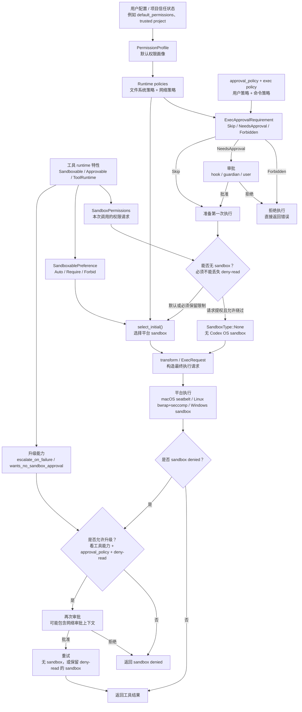

# Codex Sandbox 权限控制流程

这份笔记解释 Codex 中几类“权限控制”分别由谁决定，以及它们如何组合成一次工具调用的最终执行方式。

核心结论：

- 用户/配置决定默认权限边界和审批策略。
- 工具/runtime 决定这类工具是否适合沙箱、失败后是否能升级、单次调用是否请求额外权限。
- sandbox 层决定如何把抽象权限翻译成 macOS/Linux/Windows 的真实隔离机制。
- 不是所有工具最终都在 OS 沙箱里执行，但走工具编排的调用会先经过权限、审批和沙箱选择流程。

## 关键概念

### 用户或配置决定的部分

`PermissionProfile` 是一次会话/turn 的默认权限画像，定义在 [`codex-rs/protocol/src/models.rs`](../codex-rs/protocol/src/models.rs)。

常见内置画像：

- `:read-only`：文件系统只读，网络受限。
- `:workspace`：允许写 workspace 和临时目录，网络默认受限。
- `:danger-full-access`：禁用 Codex 管理的文件系统 sandbox。

`AskForApproval` 是审批策略，定义在 [`codex-rs/protocol/src/protocol.rs`](../codex-rs/protocol/src/protocol.rs)。

常见策略：

- `Never`：不主动询问用户，不能执行就失败。
- `OnFailure`：先在 sandbox 中尝试，失败后可请求升级。
- `OnRequest`：模型/工具请求高权限时询问。
- `UnlessTrusted`：默认更保守，经常需要审批。
- `Granular`：更细粒度地控制 sandbox、网络等审批类型。

### 工具或本次调用决定的部分

工具 runtime 会实现 `Sandboxable` / `Approvable` / `ToolRuntime`，这些接口集中在 [`codex-rs/core/src/tools/sandboxing.rs`](../codex-rs/core/src/tools/sandboxing.rs)。

工具可以表达：

- `SandboxablePreference`：这个工具是否需要/禁止/自动使用 sandbox。
- `escalate_on_failure()`：sandbox 拒绝后是否允许升级重试。
- `wants_no_sandbox_approval()`：是否愿意请求无 sandbox 重试。
- `SandboxPermissions`：本次调用是否使用默认权限、请求完全提权，或请求额外权限。

### Sandbox 层决定的部分

`SandboxManager` 把抽象权限变成具体平台执行方式，定义在 [`codex-rs/sandboxing/src/manager.rs`](../codex-rs/sandboxing/src/manager.rs)。

最终可能选择：

- `SandboxType::MacosSeatbelt`：macOS 上用 `/usr/bin/sandbox-exec`。
- `SandboxType::LinuxSeccomp`：Linux 上用 `codex-linux-sandbox`，再组合 bubblewrap 和 seccomp。
- `SandboxType::WindowsRestrictedToken`：Windows 上用 restricted token 或 elevated backend。
- `SandboxType::None`：不使用 Codex 管理的 OS sandbox。

## 配置入口对照

这里的“配置”分三种来源：

- 用户配置：用户写在 `config.toml`、通过 CLI/session override、或在 TUI/app 设置中选择。
- 工具参数：模型调用工具时传入的 JSON 字段，或 runtime 构造请求时填入的 Rust 字段。
- 程序派生：Codex 根据平台、feature flag、项目状态、运行环境自动算出来。

### 用户配置项

这些字段来自 `ConfigToml`，定义在 [`codex-rs/config/src/config_toml.rs`](../codex-rs/config/src/config_toml.rs)。加载后会进入 core 的 `Config` / `Permissions`，再成为每个 turn 的默认权限上下文。

| 控制项 | 用户怎么配置 | 代码字段 | 作用 |
| --- | --- | --- | --- |
| 审批策略 | `approval_policy = "on-request"` 等顶层 TOML 字段，也可由 CLI/session override 覆盖 | `ConfigToml.approval_policy`，`ConfigOverrides.approval_policy`，最终进入 `Permissions.approval_policy` | 决定工具调用何时需要用户、hook 或 guardian 审批 |
| 默认权限画像 | `default_permissions = ":workspace"` 或 `default_permissions = "dev"` | `ConfigToml.default_permissions` | 选择内置 profile，或选择 `[permissions.dev]` 这类命名 profile |
| 命名权限画像 | `[permissions.<name>]` | `ConfigToml.permissions` / `PermissionsToml.entries` | 定义可复用的权限 profile |
| 旧版 sandbox 模式 | `sandbox_mode = "read-only"`、`"workspace-write"`、`"danger-full-access"` | `ConfigToml.sandbox_mode` | 旧配置入口，会被转换成新的 `PermissionProfile` |
| 旧版 workspace-write 细项 | `[sandbox_workspace_write]` 下的 `writable_roots`、`network_access`、`exclude_tmpdir_env_var`、`exclude_slash_tmp` | `ConfigToml.sandbox_workspace_write` / `SandboxWorkspaceWrite` | 调整旧版 `workspace-write` 的可写根和网络行为 |
| Windows sandbox 后端 | `[windows] sandbox = "elevated"` 或 `"unelevated"` | `WindowsToml.sandbox`，最终进入 `Permissions.windows_sandbox_mode` | 决定 Windows 用 elevated backend 还是 restricted-token backend |
| Windows private desktop | `[windows] sandbox_private_desktop = true/false` | `WindowsToml.sandbox_private_desktop`，最终进入 `Permissions.windows_sandbox_private_desktop` | 决定 Windows sandboxed child 是否运行在 private desktop |
| per-command additional permissions 功能 | `[features] exec_permission_approvals = true` | `Feature::ExecPermissionApprovals` | 是否允许工具使用 `sandbox_permissions = "with_additional_permissions"` 发起临时扩权请求 |
| Linux 旧 Landlock 路径 | `[features] use_legacy_landlock = true` | `features.use_legacy_landlock()` | 已弃用。影响 Linux helper 是否使用旧 Landlock 路径 |
| 项目信任状态 | 由项目配置/信任记录决定，不是工具参数 | `active_project.is_trusted()` / `is_untrusted()` | 影响未显式配置时的默认权限画像 |

新权限 profile 的 TOML 形态来自 [`codex-rs/config/src/permissions_toml.rs`](../codex-rs/config/src/permissions_toml.rs)：

```toml
approval_policy = "on-request"
default_permissions = "dev"

[permissions.dev]
description = "Allow normal workspace work and controlled network."
extends = ":workspace"

[permissions.dev.filesystem]
"/Users/me/project" = "write"
"/Users/me/.ssh" = "deny"
glob_scan_max_depth = 4

[permissions.dev.network]
enabled = false

[features]
exec_permission_approvals = true
```

说明：

- `default_permissions` 指向 `:read-only`、`:workspace`、`:danger-full-access` 这些内置 profile，或指向 `[permissions.<name>]`。
- `[permissions.<name>.filesystem]` 是路径到 `read` / `write` / `deny` 的映射。
- `[permissions.<name>.network].enabled = true/false` 控制该 profile 的基础网络权限；更细的 domains、unix sockets、MITM 等配置属于 managed network 细项。
- 如果同时使用旧的 `sandbox_mode` 和新的 `default_permissions` / `[permissions]`，加载逻辑会做互斥检查，避免两个来源同时定义默认权限边界。

### 工具调用参数

这些不是用户配置文件字段，而是工具 schema 暴露给模型的参数，或者 runtime 内部请求结构上的字段。

shell 工具的 schema 在 [`codex-rs/core/src/tools/handlers/shell_spec.rs`](../codex-rs/core/src/tools/handlers/shell_spec.rs) 里生成。核心参数是：

| 控制项 | 工具怎么传 | Rust 字段 | 作用 |
| --- | --- | --- | --- |
| 单次 sandbox 请求 | 工具 JSON: `sandbox_permissions` | `ShellRequest.sandbox_permissions`，`UnifiedExecRequest.sandbox_permissions`，底层 `ExecParams.sandbox_permissions` | `use_default`、`require_escalated`、`with_additional_permissions` |
| 单次额外权限 | 工具 JSON: `additional_permissions` | `ShellRequest.additional_permissions`，`UnifiedExecRequest.additional_permissions`，`ApplyPatchRequest.additional_permissions` | 和 `with_additional_permissions` 搭配，临时请求文件系统或网络扩权 |
| 提权理由 | 工具 JSON: `justification` | `ShellRequest.justification`，`UnifiedExecRequest.justification`，`ExecParams.justification` | 给用户看的审批说明，通常配合 `require_escalated` |
| 可复用审批前缀 | 工具 JSON: `prefix_rule` | handler 转成 exec policy amendment | 批准类似命令时可复用的命令前缀规则 |
| 执行 cwd | 工具 JSON: `workdir` / runtime 请求 `cwd` | `ShellRequest.cwd`，`UnifiedExecRequest.cwd` | 命令实际工作目录 |
| sandbox policy cwd | runtime 内部字段 | `UnifiedExecRequest.sandbox_cwd`，`ApplyPatchRuntime::sandbox_cwd()` | 用哪个 cwd 来解析相对权限和 workspace roots |
| approval requirement | runtime/handler 内部生成 | `exec_approval_requirement` | 本次调用是 `Skip`、`NeedsApproval` 还是 `Forbidden` |

工具调用示例：

```json
{
  "cmd": "npm install",
  "workdir": "/Users/me/project",
  "sandbox_permissions": "with_additional_permissions",
  "additional_permissions": {
    "network": { "enabled": true },
    "file_system": {
      "write": ["/Users/me/.npm"]
    }
  }
}
```

这表示：

- 基础权限仍来自当前 turn 的 `PermissionProfile`。
- 本次命令请求在 sandbox 内额外允许网络，并允许写 npm cache。
- 只有启用了 `features.exec_permission_approvals` 且审批策略允许时，这个请求才会通过校验。

另一个提权示例：

```json
{
  "cmd": "sudo installer -pkg tool.pkg -target /",
  "sandbox_permissions": "require_escalated",
  "justification": "Install the package into a system location."
}
```

这表示工具请求无 sandbox 或更高权限执行。但它仍会被 `approval_policy`、exec policy 和 deny-read 规则约束。

### 工具 runtime 固定特性

这些不是模型每次传的参数，而是工具实现写死或由 handler 构造出来的行为。

| 控制项 | 配在哪里 | 作用 |
| --- | --- | --- |
| `sandbox_preference()` | 工具 runtime 的 `Sandboxable` 实现 | 告诉 orchestrator 该工具自动使用、强制使用，还是禁止使用 OS sandbox |
| `escalate_on_failure()` | 工具 runtime 的 `Sandboxable` 实现 | sandbox denied 后是否允许走升级审批和重试 |
| `wants_no_sandbox_approval()` | 工具 runtime 的 `Approvable` 默认实现或覆写 | 在不同 `AskForApproval` 策略下，是否愿意请求无 sandbox 重试 |
| `approval_keys()` | 工具 runtime 的 `Approvable` 实现 | “批准本 session” 的缓存 key。shell 通常按命令/cwd/权限，`apply_patch` 会按文件路径 |
| `permission_request_payload()` | 工具 runtime 的 `Approvable` 实现 | 给 hook/guardian/user 审批看的工具输入摘要 |
| `network_approval_spec()` | 工具 runtime 的 `ToolRuntime` 实现 | 是否接入 managed network 审批，以及即时审批还是延迟审批 |

例如 `ShellRequest` 的字段定义在 [`codex-rs/core/src/tools/runtimes/shell.rs`](../codex-rs/core/src/tools/runtimes/shell.rs)，`UnifiedExecRequest` 在 [`codex-rs/core/src/tools/runtimes/unified_exec.rs`](../codex-rs/core/src/tools/runtimes/unified_exec.rs)，`ApplyPatchRequest` 在 [`codex-rs/core/src/tools/runtimes/apply_patch.rs`](../codex-rs/core/src/tools/runtimes/apply_patch.rs)。

### Sandbox manager 派生项

这些通常不是用户直接写的字段，而是运行时根据上面配置自动算出来。

| 派生项 | 来源 | 作用 |
| --- | --- | --- |
| `PermissionProfile` | `default_permissions` / `[permissions]` / 旧 `sandbox_mode` / CLI override | 当前 turn 的规范权限画像 |
| `FileSystemSandboxPolicy` | `PermissionProfile.file_system_sandbox_policy()` | 平台无关的文件读写/deny 规则 |
| `NetworkSandboxPolicy` | `PermissionProfile.network_sandbox_policy()` | 平台无关的网络规则 |
| `SandboxType` | `SandboxManager::select_initial()` | 选择 macOS Seatbelt、Linux helper、Windows sandbox 或 `None` |
| `SandboxExecRequest` | `SandboxManager::transform()` | 已经合并 additional permissions、网络代理、平台包装命令后的执行请求 |

## 带注释流程图



## 组合规则

### 1. `PermissionProfile` 是底座

一次工具调用开始前，Codex 已经有当前 turn 的 `PermissionProfile`。它决定默认能读什么、写什么、是否能联网。

例如 `:workspace` 通常表示：

- 可以读很多系统文件。
- 可以写 workspace 和临时目录。
- `.git`、`.codex`、`.agents` 等敏感元数据仍受保护。
- 网络默认受限。

这个默认边界不是工具自己随便决定的，而是由用户配置、项目状态和启动配置编译出来的。

### 2. `SandboxPermissions` 是单次调用请求

工具可以在某一次调用上请求不同执行方式。

常见值：

- `UseDefault`：使用当前 `PermissionProfile`。
- `RequireEscalated`：请求更高权限，通常意味着希望绕过 sandbox。
- `WithAdditionalPermissions`：仍然在 sandbox 中执行，但临时增加一些读、写或网络权限。

`RequireEscalated` 不等于一定无 sandbox。Codex 会先检查审批策略，也会检查当前文件系统策略里有没有 deny-read。

### 3. deny-read 不能被无声绕过

如果当前策略中存在 deny-read，Codex 不允许直接 `SandboxType::None`。

原因很简单：deny-read 只有在 sandbox 中才能强制执行。没有 sandbox，进程就可能读到原本明确禁止读取的路径。

相关判断在 `unsandboxed_execution_allowed()`，位于 [`codex-rs/core/src/tools/sandboxing.rs`](../codex-rs/core/src/tools/sandboxing.rs)。

### 4. 审批决定“能不能做”，sandbox 决定“怎么限制”

审批和 sandbox 是两件事。

审批回答：

> 这次高风险操作是否被允许？

Sandbox 回答：

> 如果允许，执行时具体能碰哪些文件、能不能联网、由哪个平台机制限制？

所以一次调用可能：

- 不需要审批，但仍在 sandbox 中执行。
- 需要审批，审批通过后仍在 sandbox 中执行。
- 需要审批，审批通过后无 sandbox 执行。
- 因为策略或平台能力不足而拒绝执行。

### 5. 平台 sandbox 是最后落地层

`SandboxManager::select_initial()` 决定是否需要平台 sandbox。

`SandboxManager::transform()` 决定如何包装命令：

- macOS：生成 `sandbox-exec` 参数和 SBPL policy。
- Linux：生成 `codex-linux-sandbox` helper 参数。
- Windows：保留命令本身，在 exec 阶段调用 Windows sandbox backend。

这意味着业务层大多只操作统一的 `PermissionProfile`，不需要直接关心 Seatbelt、bubblewrap 或 Windows token 的细节。

## 具体场景

### 场景一：默认 workspace 下执行 `cargo test`

条件：

- 当前 profile 是 `:workspace`。
- approval policy 是 `OnFailure`。
- shell runtime 使用默认 sandbox 权限。

流程：

1. Codex 不需要先问用户。
2. `SandboxManager` 选择当前平台 sandbox。
3. `cargo test` 可以读依赖、读源码、写 target 或 workspace 内文件。
4. 如果测试试图写 `/usr/local/bin/foo`，sandbox 会拒绝。
5. 如果工具允许升级，Codex 可以再问用户是否无 sandbox 重试。

结果：

- 正常项目测试通常在 sandbox 中完成。
- 越界写系统路径时会被拦住。

### 场景二：命令请求 `RequireEscalated`

条件：

- 工具本次调用声明 `SandboxPermissions::RequireEscalated`。
- 用户审批通过。
- 当前文件系统策略没有 deny-read。

流程：

1. Orchestrator 看到本次请求需要高权限。
2. 根据 approval policy 决定是否问用户。
3. 审批通过后，`sandbox_override_for_first_attempt()` 可以选择 `SandboxType::None`。

结果：

- 命令可能直接无 Codex OS sandbox 执行。

如果当前策略包含 deny-read：

- 即使请求了 `RequireEscalated`，也不能直接无 sandbox。
- Codex 会保留 sandbox，以免泄露被 deny-read 保护的路径。

### 场景三：请求额外写权限

条件：

- 默认 profile 是 `:workspace`。
- 本次工具调用请求 `WithAdditionalPermissions`，额外允许写某个 cache 目录。

流程：

1. 基础 profile 先提供 workspace 写权限。
2. `SandboxManager::transform()` 合并 additional permissions。
3. 平台 sandbox 使用合并后的策略执行。

结果：

- 命令仍在 sandbox 中。
- 只是可写范围临时扩大。
- 这比完全无 sandbox 更窄、更容易审计。

### 场景四：网络受限但命令访问外网

条件：

- network policy 是 `Restricted`。
- managed network 开启。
- 命令执行 `curl https://api.github.com`。

流程：

1. sandbox 层只允许走受控代理或本地受控通道。
2. 代理看到目标 host。
3. Codex 构造网络审批上下文。
4. 用户可以批准或拒绝访问该 host。

结果：

- 未批准时网络请求被拒。
- 批准后，可以按策略允许本次或本 session 的访问。

### 场景五：`apply_patch` 修改文件

`apply_patch` 不是简单 shell 命令。

流程：

1. handler 先验证 patch 参数和目标路径。
2. runtime 构造 `FileSystemSandboxContext`。
3. 实际文件操作通过受控 filesystem 执行。

结果：

- 修改普通 workspace 文件通常允许。
- 修改受保护路径会被拒绝或触发审批。
- 即使没有启动一个独立 OS sandbox 进程，也仍然有逻辑层文件系统 sandbox。

## 一句话总结

Codex 的权限控制是三方合流：

- 用户配置给出默认边界。
- 工具 runtime 给出本次执行诉求。
- sandbox manager 把最终权限落到具体平台。

最终是否真的在 OS sandbox 里执行，不是固定答案；它取决于默认权限、工具请求、审批策略、平台能力，以及 deny-read 这类不能丢失的安全约束。
